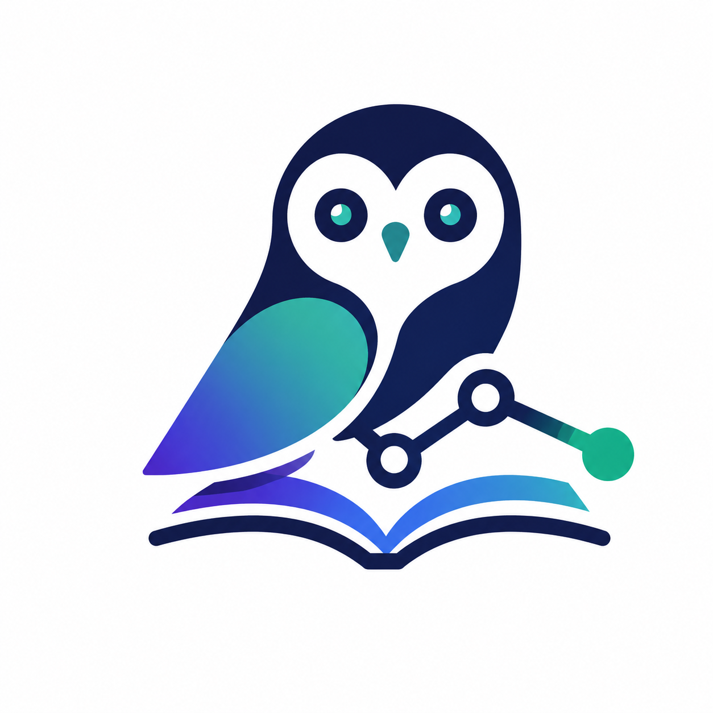
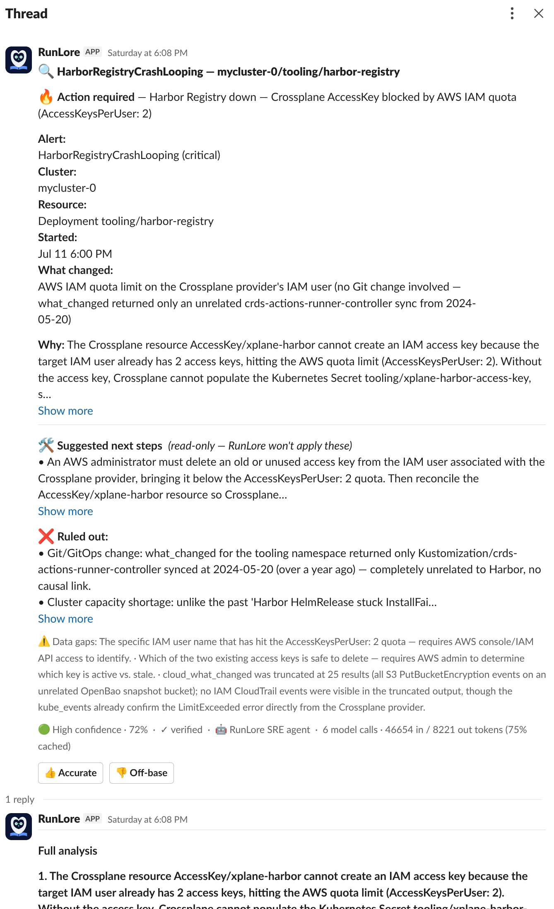
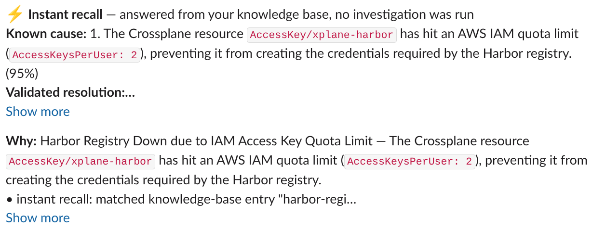
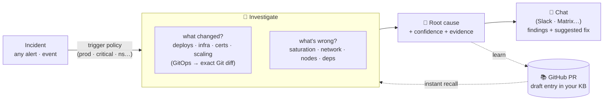
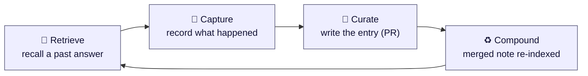

<div align="center">

<picture>
  <source media="(prefers-color-scheme: dark)" srcset="assets/logo-dark.png" />
  
</picture>

# RunLore

**An open-source SRE agent that investigates incidents — and remembers what it learns.**

[](https://github.com/Smana/runlore/actions/workflows/ci.yaml)
[](https://goreportcard.com/report/github.com/Smana/runlore)
[](go.mod)
[](LICENSE)
[](docs/design.md)

</div>

---

RunLore is an open-source SRE agent that investigates any incident — *what changed? what's wrong?*
— and posts a confidence-scored root cause to chat (Slack, Matrix…). It is **read-only by default**:
it reads your cluster, metrics, logs, and network flows — its only writes go to Git, via reviewed PRs.

What sets it apart: it learns **your** platform. Every investigation opens a PR in a Git repo you
own; a human merges it, building a knowledge base of your incidents and context. The same pattern
next time gets an instant answer — no fresh investigation.

**Learns your platform · single Go binary · runs in your cluster · on your models.**

> **The autonomy ladder.** Teams that want more than the read-only default can climb `suggest` →
> `approve`: even at the top supported rung RunLore only executes *reversible* GitOps operations after
> an **explicit human approval** — a human stays in the loop at every step
> (see [Project status](#project-status--stability)).

**Who it's for** — **SRE and platform teams** who want their incident knowledge **portable and
self-hosted** (no lock-in, your models, your data), and would rather an agent say *"I don't know"* than
guess. It shines if you run **GitOps** (Flux/Argo CD) — RunLore turns *"what changed?"* into an exact Git
diff (and, with an opt-in source-repo allowlist, into the offending commit inside an image bump) — but
GitOps isn't required: every data source is pluggable, and an unset one simply disables its tool.

## See it in action

Two sides of the same incident, delivered to your chat (shown here in Slack; Matrix delivers the same findings) — the whole point of the learning loop in one place.

**First time — a full investigation.** A verdict-first summary: the actionability call
(no action / suggested / required / inconclusive), the confidence-scored root cause, the alert
metadata and recurrence, top-cause "why", suggested next steps, ruled-out hypotheses and data gaps,
and a link to the pull request it opened in your knowledge base. With the Slack notifier's **bot token**, the full
analysis lands as a threaded reply under that summary. The footer shows the real cost — model calls
and tokens.

<div align="center">

</div>

**Next time — an instant recall.** Once that entry is merged, the same incident — even under a
*different, generic alert* — is answered straight from your knowledge base: **no investigation, no new
PR**, just the known cause, the human-reviewed resolution, and the entry's resolve-rate track record.
An order of magnitude cheaper (two model calls vs a full ReAct loop), delivered in seconds.

<div align="center">

</div>

## How it works



1. **An event fires** — a pluggable *source* triggers RunLore: an Alertmanager webhook, a GitOps failure event, or any adapter you register.
2. **RunLore investigates** — it reads your cluster, metrics, logs, and network flows.
3. **Findings land in chat** — ranked root causes with confidence, the evidence trail, and suggested next steps, delivered through a pluggable *notifier* (Slack, Matrix, a generic webhook…).
4. **A PR opens in your KB repo** — RunLore drafts what it found as a knowledge-base entry.
5. **A human reviews and merges** — after adding resolution context, the PR is merged.
   That entry is indexed: the same incident next time gets an instant answer, no re-investigation.

> 📐 **Detailed architecture:** [`docs/architecture/runlore-architecture.md`](docs/architecture/runlore-architecture.md) — the full component diagram (the flow above is the summary).

## 📚 The learning loop



The autonomous *alert → RCA → chat* loop is a commodity. What isn't: a knowledge base that
**compounds in a catalog you own**. Every merged PR becomes a searchable entry — plain markdown in a
Git repo you control, PR-reviewed, with full provenance. Knowledge that consistently resolves
incidents gains trust; knowledge that keeps failing decays.

→ **[How the learning loop works](docs/learning-loop.md)** · **[Reviewing & approving knowledge](docs/reviewing-knowledge.md)**

> [!NOTE]
> **What about "PR fatigue"?**
>
> The question comes up fast: if a team had no time to document incidents yesterday, who reviews
> AI-drafted PRs tomorrow? That's the bet, and it is a deliberate one — the review is what separates a
> memory you own from a dump of LLM output.
>
> **The volume is bounded by design.** A known incident produces **no PR at all** (it is served from
> the catalog — recalled findings are never curated); a duplicate is dropped; an incident that already
> has an open PR gets a **comment on it** rather than a new one. Only a **novel, verified** finding
> above `forge.min_confidence` (0.75), carrying evidence *and* a change-ref or a suggested action,
> ever becomes a PR.
>
> **And nothing says you review by hand.** Keep an agent in the loop during the diagnosis itself: have
> it cross-check RunLore's draft against what you found while resolving the incident, and enrich it
> with your context. You keep the *decision* — not the line-by-line reading.
>
> **Optionally, put an agent on the queue.** The [kb-steward skill](docs/kb-steward.md) triages open KB
> PRs from your terminal — quality and duplicate check per PR, a merge / refine / close call with the
> concrete fix, and a pointer at the volume levers (`forge.skip_verdicts`, `min_confidence`,
> `dup_score`) when the queue is systematically noisy. It
> recommends; you merge. Install is two commands, no binary:
>
> ```
> /plugin marketplace add Smana/runlore
> /plugin install kb-steward@runlore
> ```

## 🔌 Supported integrations

Every backend is pluggable behind an interface — **wire what you run; an unset source just disables
its tool.** GitOps (Flux / Argo CD) anchors the *what-changed* spine; everything else is optional and
additive. Full setup detail in **[Data sources](docs/data-sources.md)**.

| Category | Supported | Config |
|---|---|---|
| **GitOps** — *what changed* | Flux · Argo CD | `gitops.engine` |
| **Metrics** | VictoriaMetrics · Prometheus *(PromQL)* | `metrics.url` |
| **Logs** | VictoriaLogs *(LogsQL)* | `logs.url` |
| **Network flows** | Cilium Hubble · AWS VPC Flow Logs · GCP Firewall Logs | `network.provider` |
| **Cloud** | AWS — CloudTrail + EC2 / ASG / EKS | `cloud.provider` |
| **Kubernetes** | client-go — pod status, events, controller logs | *(in-cluster)* |
| **LLM** | Anthropic · Google Gemini · any OpenAI-compatible *(vLLM, Ollama, OpenRouter…)* | `model.provider` |
| **Triggers** *(sources)* | Alertmanager webhook · GitOps failures · PagerDuty webhook *(new)* | `sources.*` |
| **Notifiers** | Slack *(bot token: threaded summary + detail; opt-in 👍/👎 buttons)* · Matrix *(opt-in 👍/👎 reactions)* — both feed the learning loop · Slack incoming webhook / generic webhook *(single verdict-first message)* | `notify.*` |
| **Knowledge base** *(git forge)* | GitHub *(App auth)* | `forge.*` |

## ⚡ Try it in one minute — no cluster, no keys

Before you wire up a cluster, see the front of the pipeline for yourself. This runs `lore serve`
locally with a keyless demo config and fires a batch of mocked Alertmanager alerts at it — no
Kubernetes, no LLM, no credentials. You only need Go and `curl`:

```bash
hack/demo.sh
```

It builds the binary, starts the server, POSTs [`examples/alertmanager-webhook.json`](examples/alertmanager-webhook.json)
to the webhook, and prints the **trigger policy** deciding which alerts become incidents:

```text
=== trigger-policy decisions ===
msg=incident alert=HarborProbeFailure severity=critical namespace=apps investigate=true  reason="matched trigger policy"
msg=incident alert=HarborProbeFailure severity=critical namespace=apps investigate=false reason="deduplicated (still-firing)"
msg=incident alert=NoisyWarn        severity=warning  namespace=apps investigate=false reason="filtered by trigger policy"
msg=incident alert=StagingCrit      severity=critical namespace=apps investigate=false reason="filtered by trigger policy"
msg=incident alert=Watchdog         severity=critical namespace=apps investigate=false reason="filtered by trigger policy"
```

That's one alert admitted (critical + prod), the rest correctly deduped, severity-filtered,
environment-filtered, and ignore-listed — the exact gate that controls noise and LLM cost in
production. The demo stops there: a full investigation (root cause → chat → PR) needs a real cluster,
an LLM, and a knowledge base, which is the production install below. To exercise every feature
end-to-end on a throwaway cluster, `hack/e2e-k3d.sh` spins one up with [k3d](https://k3d.io/).

## 🚀 Getting started (production install)

Ready to point it at real incidents? RunLore runs in your Kubernetes cluster as a single Go binary,
deployed via Helm. Before installing, you need:

- **Data sources** — at least one wired source (each is pluggable, an unset one just disables its tool); for the *what-changed* anchor, a cluster running Flux or Argo CD, plus optionally Prometheus/VictoriaMetrics, VictoriaLogs, Hubble for richer signals
- **An LLM** — any OpenAI-compatible endpoint, Anthropic, or Gemini (in-cluster or external)
- **A knowledge-base repo** — a private GitHub repo + a scoped GitHub App; this is where RunLore commits what it learns
- **A notification destination** — a pluggable notifier: Slack, Matrix, a generic outgoing webhook, or your own

Wire your credentials into a Kubernetes `Secret`, point the chart at them via a `values.yaml`
(GitOps engine, LLM endpoint, KB repo, notification), and install:

```bash
helm install runlore deploy/helm/runlore -n runlore --create-namespace -f values.yaml
```

> The chart ships **in this repo** (`git clone` first) — there is no `helm repo add` / OCI registry
> yet. A minimal starting point for `values.yaml` is
> [`deploy/helm/runlore/values-minimal.yaml`](deploy/helm/runlore/values-minimal.yaml).

Then point a source at RunLore — for example, route your Alertmanager alerts to
`http://runlore.runlore.svc:8080/webhook/alertmanager` — and it starts investigating immediately.

**→ [Full getting-started guide](docs/getting-started.md)** — KB repo setup, GitHub App,
credentials, complete `values.yaml` reference, data sources, and verification steps.

## Why RunLore

| | What it is | What RunLore adds |
|---|---|---|
| [**k8sgpt**](https://github.com/k8sgpt-ai/k8sgpt) | A *detector* — analyzers + LLM explanation | An investigation loop, cross-signal correlation, real Git diffs, and learning |
| [**HolmesGPT**](https://github.com/HolmesGPT/holmesgpt) | The strongest OSS investigation agent | Relies on *your* hand-curated runbooks (it doesn't learn); RunLore is what-changed-first and self-improving |
| [**kagent**](https://github.com/kagent-dev/kagent) | A generic in-cluster agent *framework* | A focused, opinionated SRE agent (RunLore can run *on* kagent later) |

RunLore is **GitOps-engine-agnostic** (Flux + Argo CD), **metrics-backend-agnostic**
(VictoriaMetrics + Prometheus), with pluggable logs and CNI-agnostic network signals. Change-aware RCA
isn't unique — commercial tools (Komodor, Anyshift) diff changes too ([prior art](docs/prior-art.md)).
The wedge is the **combination the open tools don't have**: that signal feeding an **open, portable
catalog you own** ([OKF](https://github.com/GoogleCloudPlatform/knowledge-catalog)-compatible markdown,
not a proprietary store), from an agent that's **honest about the sub-50% reality**:

- `unresolved` is a first-class answer;
- an adversarial *verify* pass can only ever *lower* a finding's confidence, never raise it;
- every claim is checked by a shipped eval harness.

## Project status & stability

RunLore is **pre-1.0 and under active development** — interfaces and config may shift
between commits. It's usable today, but "stable" means different things across the surface:

- **The supported golden path is eval-tested and stable.** That's **Flux** +
  **VictoriaMetrics / Prometheus** + an **Anthropic or OpenAI-compatible** model + a **chat
  notifier** (Slack in the eval) + **GitHub** for the knowledge base. This is the path the
  [nightly eval](CONTRIBUTING.md#nightly-eval-ci) and the [k3d e2e suite](CONTRIBUTING.md#end-to-end-on-k3d)
  exercise — run it with confidence.
- **Argo CD is now end-to-end tested**, alongside Flux: the k3d suite reconfigures to the `argocd`
  engine and drives an `Application Degraded` failure through a full investigation.
- **Functional but less exercised:** **Matrix**, **Gemini**, the **PagerDuty** webhook source, cloud
  integrations, and the network (Hubble) provider. They work and are unit-tested, but see less
  real-world mileage — expect rougher edges and please file issues.
- **The `auto` autonomy rung is experimental, frozen, and not recommended on real
  clusters.** The supported posture is **read-only → suggest → approve**: RunLore reads
  and recommends, a human reviews and merges. Hands-off `auto` remains on the roadmap,
  off by default, and should not be pointed at production.

If you stay on the golden path with a human in the approval loop, you're on the surface
we test hardest.

## Docs

📐 [Design](docs/design.md) · 📚 [Learning loop](docs/learning-loop.md) · ✅ [Reviewing knowledge](docs/reviewing-knowledge.md) · 🧑‍🔧 [KB steward skill](docs/kb-steward.md) · 🚀 [Getting started](docs/getting-started.md) · 🧪 [Worked example](docs/examples/harbor-registry-down.md) ·
🔌 [Data sources](docs/data-sources.md) · ⚙️ [Configuration](docs/configuration.md) · 🔗 [MCP — server & client](docs/mcp.md) · 📊 [Observability](docs/observability.md) · 🩺 [Troubleshooting](docs/troubleshooting.md) ·
🔒 [Security model](docs/security-model.md) · 🛡 [LLM security architecture](docs/security-architecture.md) · ⬆️ [Upgrade & uninstall](docs/upgrade-uninstall.md) · 🧭 [Prior art](docs/prior-art.md) · 📊 [Benchmarking models](docs/benchmarking.md) · 🛠 [Contributing](CONTRIBUTING.md)

## License

[Apache-2.0](LICENSE).
