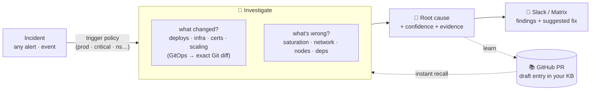
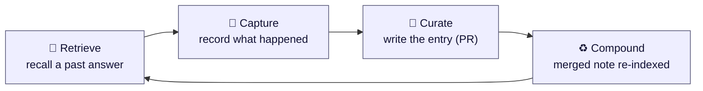

<div align="center">


# RunLore

**An open-source SRE agent that investigates incidents — and remembers what it learns.**

[](https://github.com/Smana/runlore/actions/workflows/ci.yaml)
[](https://goreportcard.com/report/github.com/Smana/runlore)
[](go.mod)
[](LICENSE)
[](docs/design.md)

</div>

---

RunLore is an open-source SRE agent that investigates any incident — *what changed? what's wrong?*
— and posts a confidence-scored root cause to chat (Slack, Matrix…). It is **read-only by default**:
it reads your cluster, metrics, logs, and network flows — its only writes go to Git, via reviewed PRs.

What sets it apart: it learns **your** platform. Every investigation opens a PR in a Git repo you
own; a human merges it, building a knowledge base of your incidents and context. The same pattern
next time gets an instant answer — no fresh investigation.

**Learns your platform · single Go binary · runs in your cluster · on your models.**

> **Note:** RunLore is read-only by default — it never mutates your cluster. An autonomy ladder
> (suggest → approve → auto) is on the roadmap for teams that want to go further.

**Who it's for** — teams on **GitOps** (Flux/Argo CD) who want their incident knowledge **portable and
self-hosted** (no lock-in, your models, your data), and would rather an agent say *"I don't know"* than guess.

## See it in action

A real RunLore investigation delivered to Slack: confidence-scored root cause, the evidence trail,
suggested next steps, open questions for a human, and a link to the pull request it opened in your
knowledge base.

<div align="center">

</div>

## How it works



1. **Alert fires** — Alertmanager or a GitOps failure event triggers RunLore via webhook.
2. **RunLore investigates** — it reads your cluster, metrics, logs, and network flows.
3. **Findings land in Slack** — ranked root causes with confidence, the evidence trail, and suggested next steps.
4. **A PR opens in your KB repo** — RunLore drafts what it found as a knowledge-base entry.
5. **A human reviews and merges** — after adding resolution context, the PR is merged.
   That entry is indexed: the same incident next time gets an instant answer, no re-investigation.

## 📚 The learning loop



The autonomous *alert → RCA → Slack* loop is a commodity. What isn't: a knowledge base that
**compounds in a catalog you own**. Every merged PR becomes a searchable entry — plain markdown in a
Git repo you control, PR-reviewed, with full provenance. Knowledge that consistently resolves
incidents gains trust; knowledge that keeps failing decays.

→ **[How the learning loop works](docs/learning-loop.md)** · **[Reviewing & approving knowledge](docs/reviewing-knowledge.md)**

## 🚀 Getting started

RunLore runs in your Kubernetes cluster as a single Go binary, deployed via Helm.
RunLore is a single binary deployed via Helm. Before installing, you need:

- **Data sources** — a cluster running Flux or Argo CD; optionally Prometheus/VictoriaMetrics, VictoriaLogs, Hubble for richer signals
- **An LLM** — any OpenAI-compatible endpoint, Anthropic, or Gemini (in-cluster or external)
- **A knowledge-base repo** — a private GitHub repo + a scoped GitHub App; this is where RunLore commits what it learns
- **A notification destination** — a Slack webhook, Matrix, or both

Wire your credentials into a Kubernetes `Secret`, point the chart at them via a `values.yaml`
(GitOps engine, LLM endpoint, KB repo, notification), and install:

```bash
helm install runlore deploy/helm/runlore -n runlore --create-namespace -f values.yaml
```

Then route your Alertmanager alerts to `http://runlore.runlore.svc:8080/webhook/alertmanager` —
RunLore starts investigating immediately.

**→ [Full getting-started guide](docs/getting-started.md)** — KB repo setup, GitHub App,
credentials, complete `values.yaml` reference, data sources, and verification steps.

---

Prefer to try it without a cluster first?

```bash
# fire mocked Alertmanager alerts through the trigger policy (no cluster)
hack/demo.sh

# verify every feature end-to-end on a throwaway k3d cluster
hack/e2e-k3d.sh
```

## Why RunLore

| | What it is | What RunLore adds |
|---|---|---|
| [**k8sgpt**](https://github.com/k8sgpt-ai/k8sgpt) | A *detector* — analyzers + LLM explanation | An investigation loop, cross-signal correlation, real Git diffs, and learning |
| [**HolmesGPT**](https://github.com/HolmesGPT/holmesgpt) | The strongest OSS investigation agent | Relies on *your* hand-curated runbooks (it doesn't learn); RunLore is what-changed-first and self-improving |
| [**kagent**](https://github.com/kagent-dev/kagent) | A generic in-cluster agent *framework* | A focused, opinionated SRE agent (RunLore can run *on* kagent later) |

RunLore is **GitOps-engine-agnostic** (Flux + Argo CD), **metrics-backend-agnostic**
(VictoriaMetrics + Prometheus), with pluggable logs and CNI-agnostic network signals. Change-aware RCA
isn't unique — commercial tools (Komodor, Anyshift) diff changes too ([prior art](docs/prior-art.md)) —
so the wedge is the **combination the open tools don't have**: that signal feeding an **open, portable
catalog you own** ([OKF](https://github.com/GoogleCloudPlatform/knowledge-catalog)-compatible markdown,
not a proprietary store), from an agent that's **honest about the sub-50% reality** — `unresolved` is a
first-class answer, an adversarial *verify* pass can only ever lower a finding's confidence, and every
claim is checked by a shipped eval harness.

## Docs

📐 [Design](docs/design.md) · 📚 [Learning loop](docs/learning-loop.md) · ✅ [Reviewing knowledge](docs/reviewing-knowledge.md) · 🚀 [Getting started](docs/getting-started.md) ·
🔌 [Data sources](docs/data-sources.md) · 📊 [Observability](docs/observability.md) ·
🧭 [Prior art](docs/prior-art.md) · 🛠 [Contributing](CONTRIBUTING.md)

## License

[Apache-2.0](LICENSE).
