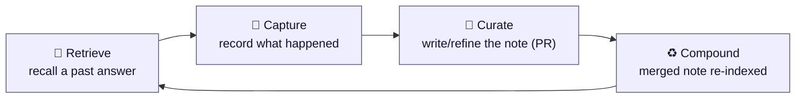
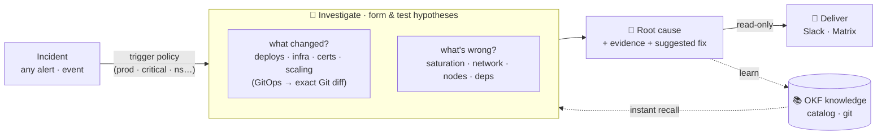

<div align="center">


# RunLore

**An open-source SRE agent that investigates any incident — and turns what it learns into knowledge _you_ own, review, and can take with you.**

[](https://github.com/Smana/runlore/actions/workflows/ci.yaml)
[](https://goreportcard.com/report/github.com/Smana/runlore)
[](go.mod)
[](LICENSE)
[](docs/design.md)

</div>

---

RunLore is an **on-call teammate that never sleeps**. It wakes on any incident — *whatever the cause* —
investigates it like a good SRE, and hands you a confidence-scored root cause with evidence:

- **What changed?** *(the sharpest first question)* — deploys, config, images, infra, certs, scaling;
  on a GitOps platform, the **exact Git diff**.
- **What's wrong?** *(when nothing changed)* — saturation, network denials, node health, dependency
  outages, load.

…and then it does the thing the closed tools keep for themselves: it **learns in the open**. Every
resolved incident becomes a **reviewed, git-versioned entry you own** — portable markdown, PR-reviewed,
provenance-tracked, never opaque vendor memory — so RunLore gets sharper at **your** platform, incident
after incident.

**Read-only by default · single Go binary · runs in your cluster · on your models.**

## 📚 The learning loop — RunLore's reason to exist

The autonomous *alert → RCA → Slack* loop is already a commodity — and frontier models still get the
root cause right less than half the time. What isn't a commodity: an agent that's **honest about that reality**
and whose knowledge **compounds in a catalog you own** — open and reviewable, never opaque vendor memory.
A normal SRE agent answers the same incident from scratch every time. RunLore **remembers** — in four moves:



- **Retrieve** — on a new incident, recall a trustworthy matching note and answer in milliseconds
  instead of re-running a multi-minute investigation (*instant recall*).
- **Capture** — record that the incident happened and whether it then actually resolved.
- **Curate** — turn a fresh, *verified* finding into a reviewable catalog entry via PR (duplicates
  collapse automatically).
- **Compound** — once a human merges the PR, the note is re-indexed and recall-able for everyone.

Two things make this **learning**, not note-taking: **outcomes feed back** (a note's trust is derived
from its real-world resolve-rate, and a note that keeps failing *decays* out of use), and **knowledge is
yours** — portable markdown in *your* Git, PR-reviewed, provenance-tracked, never opaque vendor memory.

→ Deep dive: **[How the learning loop works](docs/learning-loop.md)**
 · 👉 Your part: **[Reviewing & approving knowledge](docs/reviewing-knowledge.md)**.

## How it works



**…and here's what lands in chat** — a real RunLore investigation delivered to Slack: ranked root cause
with confidence, the evidence trail, read-only suggested next steps, open questions for a human, and a
link to the knowledge-base entry it learned.

<div align="center">

</div>

## Three pillars

| | |
|---|---|
| **React** | incident/alert webhook gated by a **trigger policy** (only prod, only critical, by namespace/team/label) · GitOps failure events · on-demand CLI / chat. The event source is pluggable. |
| **Investigate** | a ReAct loop that forms & tests hypotheses across **what changed** (deploys/infra/certs/scaling — on GitOps, the exact Git diff) **and no-change causes** (saturation/network/nodes/deps), grounds itself in your catalog, runs an **adversarial verify pass**, and reports confidence + explicit `unresolved`. |
| **Learn** | reads the cached [OKF](https://github.com/GoogleCloudPlatform/knowledge-catalog) catalog for **instant recall** and writes new incidents back as **reviewed PRs** — knowledge compounds in *your* Git. |

## Why RunLore

The bet isn't the autonomous loop (a commodity) or the change diff alone (Komodor, Anyshift and others
now diff changes too). It's the **combination the open tools don't have**: knowledge that **compounds in
a catalog _you_ own and review**, grounded in the **exact GitOps change** that caused the incident, from
an agent that's **honest about the sub-50% reality** — all **self-hosted, on your models**.

| | What it is | What RunLore adds |
|---|---|---|
| [**k8sgpt**](https://github.com/k8sgpt-ai/k8sgpt) | A *detector* — analyzers + LLM explanation | An investigation loop, cross-signal correlation, real Git diffs, and learning |
| [**HolmesGPT**](https://github.com/HolmesGPT/holmesgpt) | The strongest OSS investigation agent | Relies on *your* hand-curated runbooks (it doesn't learn); RunLore is what-changed-first and **learns in the open** |
| [**kagent**](https://github.com/kagent-dev/kagent) | A generic in-cluster agent *framework* — now with agent *memory* | A focused SRE agent whose knowledge is **open & reviewable**, not opaque per-agent vectors (RunLore can run *on* kagent later) |

RunLore is **GitOps-engine-agnostic** (Flux + Argo CD), **metrics-backend-agnostic** (VictoriaMetrics +
Prometheus), with **pluggable** logs and **CNI-agnostic network** signals — and the only one that compounds
incidents into an **open, reviewable catalog you own**: portable markdown
([OKF](https://github.com/GoogleCloudPlatform/knowledge-catalog)-compatible), not a proprietary store.

> **Who it's for** — teams who run **GitOps** (Flux/Argo CD), want their incident knowledge **portable and
> self-hosted** (data-residency, cost, no lock-in), and would rather an agent say *"I don't know"* than
> guess. If that's not you, [HolmesGPT](https://github.com/HolmesGPT/holmesgpt) or a commercial SaaS may
> fit better — and we'll say so.

## Get started

**RunLore is designed to run in your Kubernetes cluster** (`lore serve`) — that's where you get the full
React → Investigate → Learn loop: incident webhooks, the GitOps failure watch, delivery to chat, and the
learning catalog. The Helm chart is the supported path.

> ### → **[Deploy on Kubernetes — Getting Started](docs/getting-started.md)**
> Create a knowledge-base repo + a scoped GitHub App + secrets, configure the chart, then `helm install`.

Prefer to kick the tyres first? You also can, without a cluster:

```bash
# fire mocked Alertmanager alerts through the trigger policy (no cluster)
hack/demo.sh

# verify every feature end-to-end on a throwaway k3d cluster
hack/e2e-k3d.sh

# investigate one incident on-demand from your terminal (prints the findings)
lore investigate --alert HarborProbeFailure --namespace apps --config runlore.yaml
```

## Design principles

- **Cause-agnostic** — reacts to any incident and investigates any cause; "what changed" is the sharpest
  lens (deepest on GitOps), not the only one.
- **Read-only by default, with an autonomy ladder when you want it** — `off` → `suggest` → `approve`
  (human-gated) → `auto`. Every rung above read-only is reversible-only, envelope-bounded, audited, and
  kill-switchable (see [`docs/design.md`](docs/design.md)).
- **Honest about the sub-50% reality** — independent benchmarks ([ITBench](https://arxiv.org/abs/2502.05352))
  show frontier models identify the root cause less than half the time (and fully resolve far fewer).
  RunLore treats that as the baseline:
  `unresolved` is a first-class output, an adversarial *verify* pass can only ever **lower** a finding's
  confidence (never invent one), and every claim is measured by a **shipped eval harness** — not asserted
  in marketing.
- **Backend-agnostic & pluggable** — Flux + Argo CD; VictoriaMetrics + Prometheus; pluggable logs;
  **CNI-agnostic** network signals (Cilium Hubble, AWS VPC Flow Logs, or GCP Firewall Logs — see
  [data sources](docs/data-sources.md)).
- **Cloud-aware (read-only)** — correlates the cloud control plane (AWS CloudTrail "what changed" +
  EC2/ASG/EKS health) via in-cluster identity (EKS Pod Identity / IRSA).
- **Single static Go binary**, **model-agnostic** (Anthropic, Google Gemini, or any OpenAI-compatible
  endpoint — in-cluster vLLM, Ollama…), **observable** ([metrics, dashboard & alerts](docs/observability.md)),
  and **HA** via leader election.

## Docs

📐 [Design](docs/design.md) · 📚 [Learning loop](docs/learning-loop.md) · ✅ [Reviewing knowledge](docs/reviewing-knowledge.md) · 🚀 [Getting started](docs/getting-started.md) ·
🔌 [Data sources](docs/data-sources.md) · 📊 [Observability](docs/observability.md) ·
🧭 [Prior art](docs/prior-art.md) · 🛠 [Contributing](CONTRIBUTING.md)

## License

[Apache-2.0](LICENSE).
