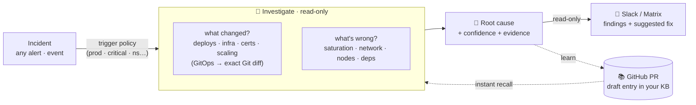
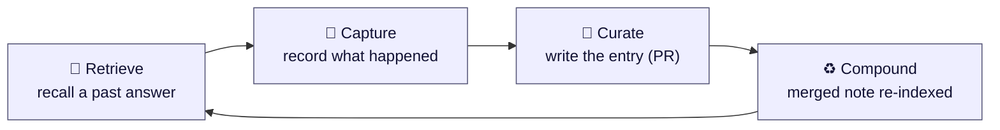

<div align="center">


# RunLore

**A read-only SRE agent that investigates incidents — and remembers what it learns.**

[](https://github.com/Smana/runlore/actions/workflows/ci.yaml)
[](https://goreportcard.com/report/github.com/Smana/runlore)
[](go.mod)
[](LICENSE)
[](docs/design.md)

</div>

---

RunLore is an open-source, **read-only** SRE agent that wakes on any incident, investigates it —
*what changed? what's wrong?* — and delivers a confidence-scored root cause to Slack. At the same
time it opens a pull request in a Git repository you own, drafting what it found as a knowledge-base
entry. A human reviews, adds context, and merges the PR: that entry is indexed, and the next time
the same pattern hits, RunLore answers in seconds — no full investigation needed.

**RunLore never mutates your cluster.** It reads Kubernetes, metrics, logs, and network flows.
Its only writes go to Git, via reviewed pull requests.

**Read-only by default · single Go binary · runs in your cluster · on your models.**

## See it in action

A real RunLore investigation delivered to Slack: confidence-scored root cause, the evidence trail,
suggested next steps, open questions for a human, and a link to the pull request it opened in your
knowledge base.

<div align="center">

</div>

## How it works



1. **Alert fires** — Alertmanager or a GitOps failure event triggers RunLore via webhook.
2. **RunLore investigates** — it reads your cluster, metrics, logs, and network flows. It never writes to the cluster.
3. **Findings land in Slack** — ranked root causes with confidence, the evidence trail, and suggested next steps.
4. **A PR opens in your KB repo** — RunLore drafts what it found as a knowledge-base entry.
5. **A human reviews and merges** — after adding resolution context, the PR is merged.
   That entry is indexed: the same incident next time gets an instant answer, no re-investigation.

## 📚 The learning loop



The autonomous *alert → RCA → Slack* loop is a commodity. What isn't: a knowledge base that
**compounds in a catalog you own**. Every merged PR becomes a searchable entry — plain markdown in a
Git repo you control, PR-reviewed, with full provenance. Knowledge that consistently resolves
incidents gains trust; knowledge that keeps failing decays.

→ **[How the learning loop works](docs/learning-loop.md)** · **[Reviewing & approving knowledge](docs/reviewing-knowledge.md)**

## 🚀 Getting started

RunLore runs in your Kubernetes cluster as a single Go binary, deployed via Helm.
You need four things before installing:

| | What | Why |
|---|---|---|
| **Cluster + data sources** | Flux or Argo CD; optionally Prometheus/VictoriaMetrics, VictoriaLogs, Hubble | The investigation signals |
| **LLM** | Any OpenAI-compatible endpoint, Anthropic, or Gemini — in-cluster or external | The investigation engine |
| **Knowledge-base repo** | A private GitHub repo + a GitHub App (scoped read/write) | Where RunLore commits what it learns |
| **Notifications** | A Slack webhook (or Matrix) | Where findings are delivered |

### Step 1 — Create your KB repo

Create a private GitHub repo (e.g. `your-org/runlore-kb`). Seed it with existing runbooks if you
have them — RunLore will grow it from there. Then create a **GitHub App**, install it on that repo
with `Contents` + `Pull requests` + `Issues` (read/write), and note the App ID, Installation ID,
and private key.

### Step 2 — Create your secrets

```bash
kubectl -n runlore create secret generic runlore-secrets \
  --from-literal=SLACK_WEBHOOK_URL='https://hooks.slack.com/services/...' \
  --from-literal=OPENAI_API_KEY='<your-api-key>' \
  --from-file=GITHUB_APP_PRIVATE_KEY=/path/to/app.pem
```

### Step 3 — Configure

Create a minimal `values.yaml`:

```yaml
envFrom:
  - secretRef:
      name: runlore-secrets

catalog:
  gitSync: true

config:
  gitops:
    engine: flux             # or argocd
  model:
    base_url: http://vllm.llm.svc:8000/v1
    model: your-model
    api_key_env: OPENAI_API_KEY
  notify:
    slack:
      webhook_url_env: SLACK_WEBHOOK_URL
  forge:
    kb_repo: your-org/runlore-kb
    github_app:
      app_id: 123456
      installation_id: 7654321
      private_key_env: GITHUB_APP_PRIVATE_KEY
```

### Step 4 — Install

```bash
helm install runlore deploy/helm/runlore -n runlore --create-namespace -f values.yaml
```

Then point Alertmanager at `http://runlore.runlore.svc:8080/webhook/alertmanager` and RunLore
starts investigating.

> **→ [Full getting-started guide](docs/getting-started.md)** — GitHub App setup,
> metrics/logs/network data sources, AWS cloud context, HA, and verification steps.

---

Prefer to try it without a cluster first?

```bash
# fire mocked Alertmanager alerts through the trigger policy (no cluster)
hack/demo.sh

# verify every feature end-to-end on a throwaway k3d cluster
hack/e2e-k3d.sh
```

## Why RunLore

| | What it is | What RunLore adds |
|---|---|---|
| [**k8sgpt**](https://github.com/k8sgpt-ai/k8sgpt) | A *detector* — analyzers + LLM explanation | An investigation loop, cross-signal correlation, real Git diffs, and learning |
| [**HolmesGPT**](https://github.com/HolmesGPT/holmesgpt) | The strongest OSS investigation agent | Relies on *your* hand-curated runbooks (it doesn't learn); RunLore is what-changed-first and self-improving |
| [**kagent**](https://github.com/kagent-dev/kagent) | A generic in-cluster agent *framework* | A focused, opinionated SRE agent (RunLore can run *on* kagent later) |

RunLore is **GitOps-engine-agnostic** (Flux + Argo CD), **metrics-backend-agnostic**
(VictoriaMetrics + Prometheus), with pluggable logs and CNI-agnostic network signals — and the only
OSS agent that learns into an **open** [OKF](https://github.com/GoogleCloudPlatform/knowledge-catalog)
catalog you own.

## Docs

📐 [Design](docs/design.md) · 📚 [Learning loop](docs/learning-loop.md) · ✅ [Reviewing knowledge](docs/reviewing-knowledge.md) · 🚀 [Getting started](docs/getting-started.md) ·
🔌 [Data sources](docs/data-sources.md) · 📊 [Observability](docs/observability.md) ·
🧭 [Prior art](docs/prior-art.md) · 🛠 [Contributing](CONTRIBUTING.md)

## License

[Apache-2.0](LICENSE).
