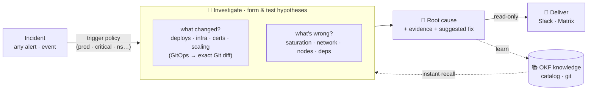

<div align="center">


# RunLore

**An open-source SRE agent that investigates any incident — and learns _your_ platform as it goes.**

[](https://github.com/Smana/runlore/actions/workflows/ci.yaml)
[](https://goreportcard.com/report/github.com/Smana/runlore)
[](go.mod)
[](LICENSE)
[](docs/design.md)

</div>

---

RunLore is an **on-call teammate that never sleeps**. It wakes on any incident — *whatever the cause* —
and works it like a good SRE:

- **What changed?** *(the sharpest first question)* — deploys, config, images, infra, certs, scaling;
  on a GitOps platform, the **exact Git diff**.
- **What's wrong?** *(when nothing changed)* — saturation, network drops, node health, dependency
  outages, load.

…then it hands you a confidence-scored root cause with evidence and **learns** — each resolved incident
becomes a reviewed entry in an open, git-versioned knowledge base, so it gets sharper at **your**
platform over time.

**Read-only first · single Go binary · in your terminal or your cluster · on your models.**

## Why another one?

The autonomous *alert → RCA → Slack* loop is already a **commodity**. RunLore's bet is the part that
isn't: a **GitOps-native "what changed" spine** and an **open knowledge base that compounds**.

| | What it is | What RunLore adds |
|---|---|---|
| [**k8sgpt**](https://github.com/k8sgpt-ai/k8sgpt) | A *detector* — analyzers + LLM explanation | An investigation loop, cross-signal correlation, real Git diffs, and learning |
| [**HolmesGPT**](https://github.com/HolmesGPT/holmesgpt) | The strongest OSS investigation agent | Prometheus/Loki-centric and relies on *your* hand-curated runbooks (it doesn't learn); RunLore is metrics-agnostic, what-changed-first, and self-improving |
| [**kagent**](https://github.com/kagent-dev/kagent) | A generic in-cluster agent *framework* | A focused, opinionated SRE agent (and RunLore can run *on* kagent later) |

RunLore is **GitOps-engine-agnostic** (Flux + Argo), **metrics-backend-agnostic** (VictoriaMetrics +
Prometheus), and the only one that **learns into an open** [OKF](https://github.com/GoogleCloudPlatform/knowledge-catalog)
knowledge catalog you own — portable markdown in git, never vendor lock-in.

## How it works



## Three pillars

| | |
|---|---|
| **React** | incident/alert webhook gated by a **trigger policy** (only prod, only critical, by namespace/team/label) · GitOps failure events · proactive watch · on-demand CLI / chat |
| **Investigate** | forms & tests hypotheses across **what changed** (deploys/infra/certs/scaling — on GitOps, the exact Git diff) **and no-change causes** (saturation/network/nodes/deps) · runbook-grounded · confidence + explicit `unresolved` |
| **Learn** | reads a cached [OKF](https://github.com/GoogleCloudPlatform/knowledge-catalog) catalog (instant recall) and writes new incidents back via reviewed PRs — knowledge compounds in *your* git |

## Design principles

- **Cause-agnostic** — reacts to any incident and investigates any cause; "what changed" is the sharpest lens (deepest on GitOps), not the only one.
- **Read-only first** — v1 ships no cluster-mutating tools (rung 0 of an autonomy ladder; see [`docs/design.md`](docs/design.md)).
- **GitOps- and metrics-agnostic** — Flux + ArgoCD, VictoriaMetrics + Prometheus; logs/network pluggable.
- **Single static Go binary** — terminal (`lore investigate`) or in-cluster (`lore serve`).
- **Model-agnostic** — Anthropic or any OpenAI-compatible endpoint (in-cluster vLLM, Ollama…); your telemetry needn't leave the boundary.
- **Built-in core providers, MCP as the extension layer** — self-contained, but composable.
- **Pluggable notifications** — Slack + Matrix first; PagerDuty and incident.io next.

## Quickstart

> Early development — the React foundation (`lore serve`) works today; the investigation loop is landing.

```bash
go build ./...

# end-to-end demo: fire mocked Alertmanager alerts through the trigger policy
hack/demo.sh

# run the agent: react to incident webhooks per your trigger policy
lore serve --config runlore.yaml
```

## Status & docs

- 📐 [Design](docs/design.md) · [Prior art & positioning](docs/prior-art.md) · [Plans](docs/plans/)
- ✅ Phase 1 — React foundation (trigger policy + `lore serve`)
- 🚧 What-changed spine (Git revision diffing) → GitOps providers (Flux/Argo) → correlation → catalog → investigation loop

## License

[Apache-2.0](LICENSE).
