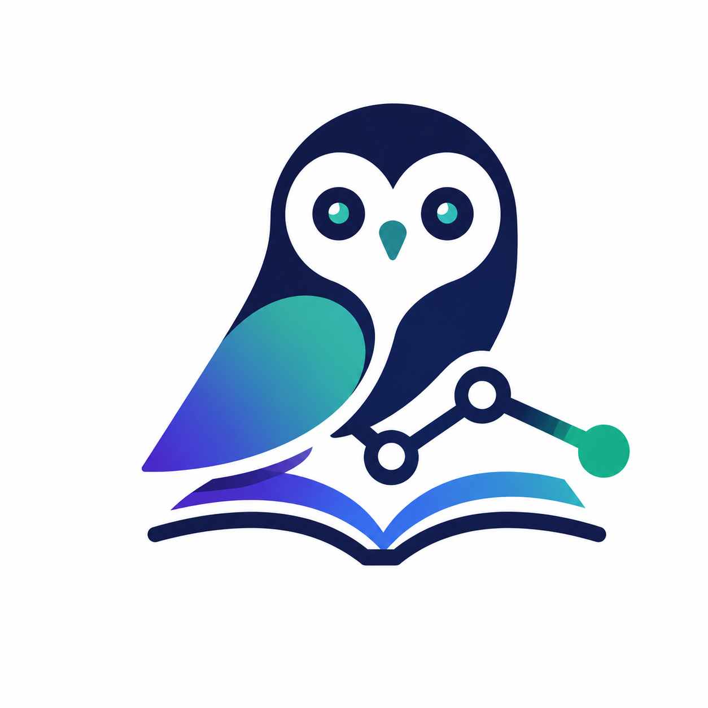
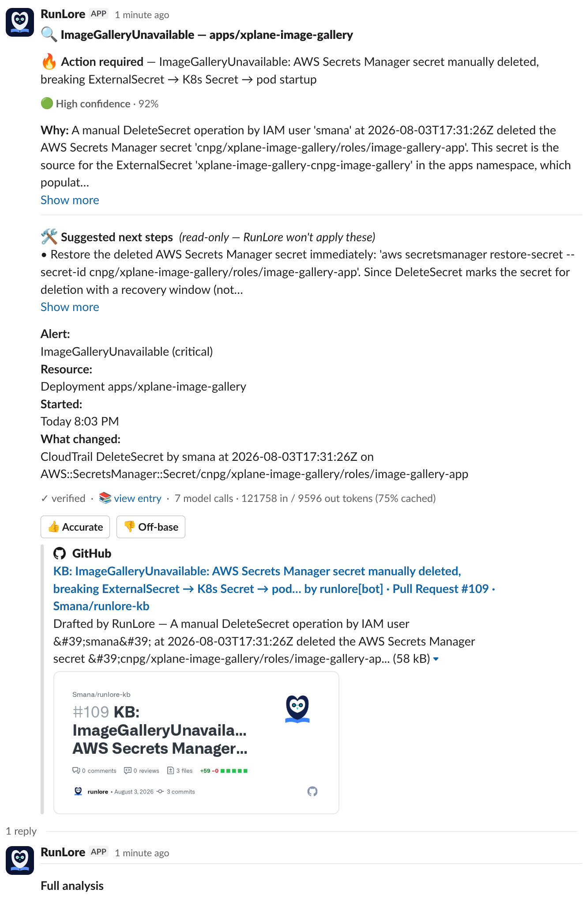
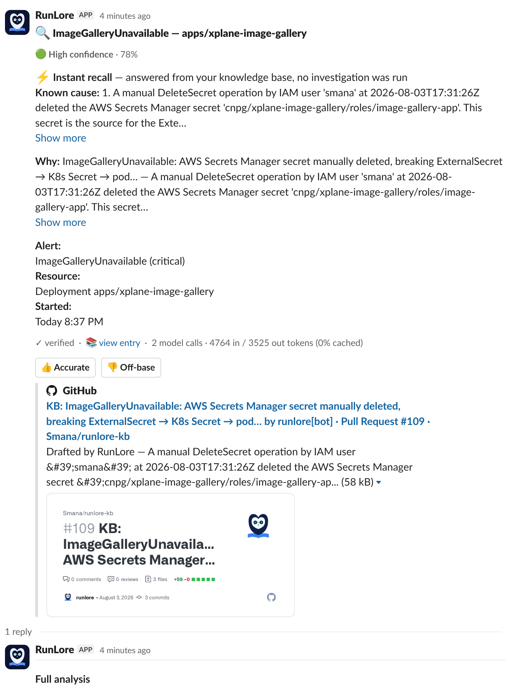
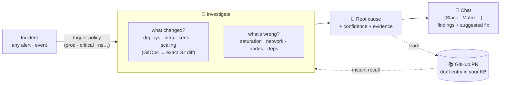
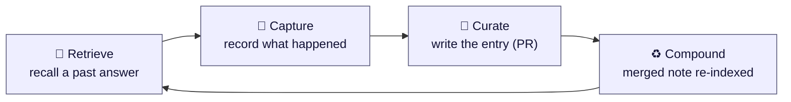

<div align="center">

<picture>
  <source media="(prefers-color-scheme: dark)" srcset="assets/logo-dark.png" />
  
</picture>

# RunLore

**An open-source SRE agent that investigates incidents — and remembers what it learns.**

### 📖 Read the docs → **[runlore.io](https://runlore.io/)**

[](https://runlore.io/)
[](https://github.com/Smana/runlore/actions/workflows/ci.yaml)
[](https://runlore.io/eval)
[](https://scorecard.dev/viewer/?uri=github.com/Smana/runlore)
[](https://goreportcard.com/report/github.com/Smana/runlore)
[](go.mod)
[](LICENSE)
[](https://runlore.io/docs/concepts/design/)

</div>

---

RunLore is an open-source SRE agent that investigates any incident — *what changed? what's wrong?*
— and posts a confidence-scored root cause to chat (Slack, Matrix…). It is **read-only by default**:
it reads your cluster, metrics, logs, and network flows — its only writes go to Git, via reviewed PRs.

What sets it apart: it learns **your** platform. Every investigation opens a PR in a Git repo you
own; a human merges it, building a knowledge base of your incidents and context. The same pattern
next time gets an instant answer — no fresh investigation.

**Learns your platform · single Go binary · runs in your cluster · on your models.**

## See it in action

The same incident, twice — and the second time is the whole point. Shown here in Slack; Matrix
delivers the same findings.

**First time — a full investigation.** **7 model calls, 131,354 tokens.** A verdict-first card: the
actionability call, a confidence-scored root cause with the evidence behind it, and suggested next
steps it will *not* apply for you.

<div align="center">

</div>

**Next time — an instant recall. 2 model calls, 8,289 tokens: about 6% of the cost, in seconds.**
Once you merge the entry, the same failure — even under a *different, generic alert* — is answered
straight from your knowledge base: no investigation, no second PR, and it cites the entry so you can
check it.

<div align="center">

</div>

<details>
<summary><b>What's in those cards, in full</b></summary>

Both cards are that one incident on a live cluster, so the cost is a matched pair — 8,289 tokens
recalled against 131,354 investigated.

**On the investigation.** The actionability call is one of *no action / suggested / required /
inconclusive*. Alert metadata, recurrence and a link to the knowledge-base PR appear alongside when
the incident carries them. With the Slack notifier's **bot token**, the full analysis lands as a
threaded reply — open questions, data gaps and ruled-out hypotheses. The footer shows the real cost:
model calls and tokens.

**On the recall.** As shipped it is **two** model calls — the LLM reranker that picks the entry, then
the adversarial verify pass — against the **7** the full investigation took. A recall is *re-checked,
not replayed*: the verify pass is why the recalled card reads 78% where the stored entry says 92%,
and it falls through to a full investigation if it cannot confirm the entry. Once the entry has a
track record its resolve rate is shown alongside, and that record weighs whether recall is trusted
enough to fire at all.

</details>

## ⚡ Try it in one minute — no cluster, no keys

Before you wire up anything, watch RunLore investigate a real incident and reach a real root cause —
no Kubernetes, no LLM key, no network. You only need Go:

```bash
hack/demo.sh
```

It replays a transcript recorded once against a live model through the **real investigation loop**:
the same ReAct tool calls, verify pass, and verdict-card renderer that run in production, over fake
(but realistic) evidence. [What it prints ↓](#what-the-demo-prints)

## How it works


```mermaid
flowchart LR
    A["Incident<br/>any alert · event"] -->|"trigger policy<br/>(prod · critical · ns…)"| B
    subgraph B["🔎 Investigate"]
      direction TB
      W["what changed?<br/>deploys · infra · certs · scaling<br/>(GitOps → exact Git diff)"]
      C["what's wrong?<br/>saturation · network · nodes · deps"]
    end
    B --> R["🎯 Root cause<br/>+ confidence + evidence"]
    R --> D["💬 Chat<br/>(Slack · Matrix…)<br/>findings + suggested fix"]
    R -. learn .-> K[("📚 GitHub PR<br/>draft entry in your KB")]
    K -. instant recall .-> B
```

1. **An event fires** — a pluggable *source* triggers RunLore: an Alertmanager webhook, a GitOps failure event, or any adapter you register.
2. **RunLore investigates** — it reads your cluster, metrics, logs, and network flows.
3. **Findings land in chat** — ranked root causes with confidence, the evidence trail, and suggested next steps, delivered through a pluggable *notifier* (Slack, Matrix, a generic webhook…).
4. **A PR opens in your KB repo** — RunLore drafts what it found as a knowledge-base entry.
5. **A human reviews and merges** — after adding resolution context, the PR is merged.
   That entry is indexed: the same incident next time gets an instant answer, no re-investigation.

> 📐 **Detailed architecture:** [`docs/architecture/runlore-architecture.md`](https://runlore.io/docs/concepts/architecture/) — the full component diagram (the flow above is the summary).

## 📚 The learning loop


```mermaid
flowchart LR
    R["🔎 Retrieve<br/>recall a past answer"] --> C["🧪 Capture<br/>record what happened"]
    C --> U["📝 Curate<br/>write the entry (PR)"]
    U --> P["♻️ Compound<br/>merged note re-indexed"]
    P --> R
    classDef s fill:#eef,stroke:#557,stroke-width:1px,color:#113;
    class R,C,U,P s;
```

The autonomous *alert → RCA → chat* loop is a commodity. What isn't: a knowledge base that
**compounds in a catalog you own**. Every merged PR becomes a searchable entry — plain markdown in a
Git repo you control, PR-reviewed, with full provenance. Knowledge that consistently resolves
incidents gains trust; knowledge that keeps failing decays.

Starting from empty is optional. The [knowledge commons](https://github.com/Smana/runlore-kb-commons)
is a shared bundle of generic playbooks you can mount as a second, read-only catalog root, so
`kb_search` is useful on day one. Your own entries always win ties, and the curator never writes
there — it is a floor, not a substitute for knowledge from your own incidents.

An instant recall is never a blind cache hit — three gates stand in front of it: the entry must
**structurally match** the incident (same workload/resource, retrieval score above a floor), it must
**win by a clear margin** over the runner-up entry (ambiguous matches fall through to a full
investigation), and its confidence is **weighted by its real-world track record** — an entry that
keeps resolving incidents gains trust, one that keeps failing decays toward re-investigation.
Even then, the recalled finding goes through the same adversarial verify pass as a fresh one — and if
that pass can't run (e.g. a model outage), recall fails closed and falls through to a full
investigation rather than serving the answer unreviewed. That trade isn't free: you pay the
reranker's call, the failed verify call, and *then* a full ReAct loop, and it lands exactly when
the verify endpoint is already unhealthy — worth knowing ahead of an incident, not during one. The
shipped eval suite includes a poisoned-entry scenario proving a bad entry is rejected at recall time.

→ **[How the learning loop works](https://runlore.io/docs/concepts/learning-loop/)** · **[Reviewing & approving knowledge](https://runlore.io/docs/concepts/reviewing-knowledge/)**

> [!NOTE]
> **What about "PR fatigue"?**
>
> The question comes up fast: if a team had no time to document incidents yesterday, who reviews
> AI-drafted PRs tomorrow? That's the bet, and it is a deliberate one — the review is what separates a
> memory you own from a dump of LLM output.
>
> **The volume is bounded by design.** A known incident produces **no PR at all** (it is served from
> the catalog — recalled findings are never curated); a duplicate is dropped; an incident that already
> has an open PR gets a **comment on it** rather than a new one. Only a **novel, verified** finding
> above `forge.min_confidence` (0.75), carrying evidence *and* a change-ref or a suggested action,
> ever becomes a PR.
>
> **And nothing says you review by hand.** Keep an agent in the loop during the diagnosis itself: have
> it cross-check RunLore's draft against what you found while resolving the incident, and enrich it
> with your context. You keep the *decision* — not the line-by-line reading.
>
> **Optionally, put an agent on the queue.** The [kb-steward skill](https://runlore.io/docs/reference/kb-steward/) triages open KB
> PRs from your terminal — quality and duplicate check per PR, a merge / refine / close call with the
> concrete fix, and a pointer at the volume levers (`forge.skip_verdicts`, `min_confidence`,
> `dup_score`) when the queue is systematically noisy. It
> recommends; you merge. Install is two commands, no binary:
>
> ```
> /plugin marketplace add Smana/runlore
> /plugin install kb-steward@runlore
> ```

## 🔌 Supported integrations

Every backend is pluggable behind an interface — **wire what you run; an unset source just disables
its tool.** GitOps (Flux / Argo CD) anchors the *what-changed* spine; everything else is optional and
additive. Full setup detail in **[Data sources](https://runlore.io/docs/concepts/data-sources/)**.

| Category | Supported | Config |
|---|---|---|
| **GitOps** — *what changed* | Flux · Argo CD | `gitops.engine` |
| **Metrics** | VictoriaMetrics · Prometheus *(PromQL)* | `metrics.url` |
| **Logs** | VictoriaLogs *(LogsQL)* | `logs.url` |
| **Network flows** | Cilium Hubble · AWS VPC Flow Logs · GCP Firewall Logs | `network.provider` |
| **Cloud** | AWS — CloudTrail + EC2 / ASG / EKS | `cloud.provider` |
| **Kubernetes** | client-go — pod status, events, controller logs | *(in-cluster)* |
| **LLM** | Anthropic · Google Gemini · any OpenAI-compatible *(vLLM, Ollama, OpenRouter…)* | `model.provider` |
| **Triggers** *(sources)* | Alertmanager webhook · GitOps failures · PagerDuty webhook *(new)* | `sources.*` |
| **Notifiers** | Slack *(bot token: threaded summary + detail; opt-in 👍/👎 buttons)* · Matrix *(opt-in 👍/👎 reactions)* — both feed the learning loop · Slack incoming webhook / generic webhook *(single verdict-first message)* | `notify.*` |
| **Knowledge base** *(git forge)* | GitHub *(App auth)* | `forge.*` |
| **MCP** | Server — query your KB from Claude Code / any MCP client · Client — wire external MCP tool servers into investigations (allowlist-gated) | `mcp.*` |

## No native integration? Point RunLore at any MCP server

RunLore ships a **narrow, deliberate native tool set** — cluster, metrics, logs, network flows,
GitOps history, cloud control plane, knowledge search. It does not try to match the
[56 built-in toolsets](https://holmesgpt.dev/latest/data-sources/builtin-toolsets/) of the
largest OSS agent, and it shouldn't.

Instead it ships an **MCP client**: point it at any Model Context Protocol server (`mcp.servers`
in the config) and those tools join the investigation loop, governed by the same allowlist and
the same read-only posture as everything else. Whatever your stack has that RunLore doesn't
ship natively, MCP closes the gap.

RunLore is also an MCP **server** — `lore mcp` exposes what-changed and knowledge-base search
to Claude Code, HolmesGPT, or any other MCP client.

→ [MCP configuration](https://runlore.io/docs/configuration/mcp/)

## What the demo prints

[`hack/demo.sh`](#-try-it-in-one-minute--no-cluster-no-keys) builds the binary and replays the
recorded transcript through the real investigation loop:

```text
== RunLore demo: investigating "harbor-chart-bump" (recorded model turns, fake providers, no cluster) ==
   model turns recorded 2026-08-02T07:48:52Z with openai/glm-4.5-air

incident: HarborProbeFailure (critical, prod, namespace apps): harbor-core readiness probes
are failing and the Service is returning 503s.

→ what_changed()
  flux Kustomization/apps aaa111..bbb222 --- apps/harbor/values.yaml - tag: 1.14.2 + tag: 1.15.0 …
→ query_metrics()
  up{job="harbor-core"} = 0 kube_pod_container_status_restarts_total{pod="harbor-db-0"} = 7
→ query_logs()
  harbor-db-0 FATAL: could not obtain migration lock; another migration is in progress …

== submit_findings ==
*Investigation* — confidence 90%
🔥 Verdict: Action required
Resource: Deployment apps/harbor-core
1. *Database migration deadlock preventing harbor-db pod from starting, causing harbor-core
   connection failures* (90%)
   • harbor-db-0 FATAL: could not obtain migration lock; another migration is in progress
   • Chart bump to 1.15.0 enabled DB schema migrations
   → suggested: Investigate and resolve the migration deadlock in harbor-db pod, then restart
     the database to clear the lock (reversible)
```

That is a genuine root cause, not canned copy — recorded once against a live model, replayed
forever with zero key and zero network. Wiring a cluster below gets you this over live evidence,
with chat and knowledge-base write-back. Curious about the filter that decides what gets
investigated in the first place? `hack/demo-trigger-policy.sh` fires mocked Alertmanager alerts
through the trigger policy. To exercise every feature end-to-end on a throwaway cluster,
`hack/e2e-k3d.sh` spins one up with [k3d](https://k3d.io/).

**Ran it? Tell me where it would have been wrong.** Whether that verdict matches a failure you
have actually had — and where it would have missed on *your* platform — is the single most useful
thing you can send, and that includes deciding RunLore isn't for you. A
[discussion](https://github.com/Smana/runlore/discussions) is enough; no deployment required.

## Who it's for

**SRE and platform teams** who want their incident knowledge **portable and self-hosted** (no
lock-in, your models, your data), and would rather an agent say *"I don't know"* than guess. It
shines if you run **GitOps** (Flux/Argo CD) — RunLore turns *"what changed?"* into an exact Git diff
(and, with an opt-in source-repo allowlist, into the offending commit inside an image bump) — but
GitOps isn't required: every data source is pluggable, and an unset one simply disables its tool.

> **The autonomy ladder.** Teams that want more than the read-only default can climb `suggest` →
> `approve`: even at the top supported rung RunLore only executes *reversible* GitOps operations after
> an **explicit human approval** — a human stays in the loop at every step
> (see [Project status](#project-status--stability)).

## 🚀 Getting started (production install)

Ready to point it at real incidents? RunLore runs in your Kubernetes cluster as a single Go binary,
deployed via Helm. Before installing, you need:

- **Data sources** — at least one wired source (each is pluggable, an unset one just disables its tool); for the *what-changed* anchor, a cluster running Flux or Argo CD, plus optionally Prometheus/VictoriaMetrics, VictoriaLogs, Hubble for richer signals
- **An LLM** — any OpenAI-compatible endpoint, Anthropic, or Gemini (in-cluster or external)
- **A knowledge-base repo** — a private GitHub repo + a scoped GitHub App; this is where RunLore commits what it learns
- **A notification destination** — a pluggable notifier: Slack, Matrix, a generic outgoing webhook, or your own

Wire your credentials into a Kubernetes `Secret`, point the chart at them via a `values.yaml`
(GitOps engine, LLM endpoint, KB repo, notification), and install:

```bash
helm install runlore oci://ghcr.io/smana/charts/runlore -n runlore --create-namespace -f values.yaml
```

> The chart is an **OCI artifact on GHCR** — no `git clone`, no `helm repo add`. It is published and
> cosign-signed on every release; pin a version with `--version X.Y.Z`. Don't write `values.yaml` from
> scratch — the chart ships three profiles:
> [`values-minimal.yaml`](deploy/helm/runlore/values-minimal.yaml) (investigate + notify, ~15 lines),
> [`values-standard.yaml`](deploy/helm/runlore/values-standard.yaml) (adds the knowledge catalog,
> curation, metrics + logs), and
> [`values-full.yaml`](deploy/helm/runlore/values-full.yaml) (adds HA, persistence, NetworkPolicy, the
> action ladder).
> Working from a clone (dev alternative):
> `helm install runlore deploy/helm/runlore -n runlore --create-namespace -f values.yaml`.

Then point a source at RunLore — for example, route your Alertmanager alerts to
`http://runlore.runlore.svc:8080/webhook/alertmanager` — and it starts investigating immediately.

**→ [Full getting-started guide](https://runlore.io/docs/getting-started/)** — KB repo setup, GitHub App,
credentials, complete `values.yaml` reference, data sources, and verification steps.

## Why RunLore

| | What it is | What RunLore adds |
|---|---|---|
| [**k8sgpt**](https://github.com/k8sgpt-ai/k8sgpt) | A *detector* — analyzers + LLM explanation | An investigation loop, cross-signal correlation, real Git diffs, and learning |
| [**HolmesGPT**](https://github.com/HolmesGPT/holmesgpt) | The strongest OSS investigation agent | Relies on *your* hand-curated runbooks (it doesn't learn); RunLore is what-changed-first and self-improving |
| [**kagent**](https://github.com/kagent-dev/kagent) | A generic in-cluster agent *framework* | A focused, opinionated SRE agent (RunLore can run *on* kagent later) |

RunLore is **GitOps-engine-agnostic** (Flux + Argo CD), **metrics-backend-agnostic**
(VictoriaMetrics + Prometheus), with pluggable logs and CNI-agnostic network signals. Change-aware RCA
isn't unique — commercial tools (Komodor, Anyshift) diff changes too ([prior art](https://runlore.io/docs/concepts/prior-art/)).
The wedge is the **combination the open tools don't have**: that signal feeding an **open, portable
catalog you own** — [OKF](https://github.com/GoogleCloudPlatform/knowledge-catalog)-compatible
markdown, not a proprietary store; as far as we know RunLore is the **first agent that *produces*
OKF entries from its own investigations** — from an agent that's **honest about the sub-50% reality**:

- `unresolved` is a first-class answer;
- an adversarial *verify* pass can only ever *lower* a finding's confidence, never raise it;
- every claim is checked by a shipped eval harness, and the nightly results are
  [published — pass, fail, model, and cost included](https://runlore.io/eval).

## Project status & stability

RunLore is **pre-1.0 and under active development** — interfaces and config may shift
between commits. It's usable today, but "stable" means different things across the surface:

- **The supported golden path is eval-tested and stable.** That's **Flux** +
  **VictoriaMetrics / Prometheus** + an **Anthropic or OpenAI-compatible** model + a **chat
  notifier** (Slack in the eval) + **GitHub** for the knowledge base. This is the path the
  [nightly eval](CONTRIBUTING.md#nightly-eval-ci) and the [k3d e2e suite](CONTRIBUTING.md#end-to-end-on-k3d-or-kind)
  exercise — run it with confidence.
- **Argo CD is now end-to-end tested**, alongside Flux — including the **`approve` rung**: the k3d
  suite reconfigures to the `argocd` engine, drives an `Application Degraded` failure through a full
  investigation, then human-approves a **pause-auto-sync** action that executes reversibly (the prior
  `syncPolicy.automated` is preserved for resume). Both engines share the same reversible-only,
  allowlisted action envelope.
- **Functional but less exercised:** **Matrix**, **Gemini**, the **PagerDuty** webhook source, cloud
  integrations, and the network (Hubble) provider. They work and are unit-tested, but see less
  real-world mileage — expect rougher edges and please file issues.
- **The `auto` autonomy rung is experimental, frozen, and not recommended on real
  clusters.** The supported posture is **read-only → suggest → approve**: RunLore reads
  and recommends, a human reviews and merges. Hands-off `auto` remains on the roadmap,
  off by default, and should not be pointed at production.

If you stay on the golden path with a human in the approval loop, you're on the surface
we test hardest.

## Who maintains this

**One person, today.** RunLore is written and maintained by [@Smana](https://github.com/Smana).
That is the honest answer to the question you should be asking before you run an agent next to
your production cluster, so here is what it does and doesn't mean.

**What it means.** There is no support rotation and no SLA. Issues get answered as fast as one
person with a day job can answer them. A bus-factor of one is a real risk and no amount of test
coverage retires it.

**What it doesn't mean.** If RunLore stopped being maintained tomorrow, you would lose the
agent — not what it learned. That is deliberate, and it is the whole reason the knowledge base
is shaped the way it is:

- Your catalog is **plain [OKF](https://github.com/GoogleCloudPlatform/knowledge-catalog)
  markdown in a Git repo you already own**. Not a database, not a proprietary format, not
  hosted here. It stays greppable and readable by whatever you use next.
- There is **no hosted component** and no account. Nothing switches off remotely.
- It's **Apache-2.0**, a single Go binary, with a published Helm chart. Fork it and carry on.

So the worst case is that you stop getting new features and keep everything you built. That
trade is the point — the same reason the catalog is portable is the reason abandonment isn't
fatal.

**Reducing the risk.** The fastest way to widen the bus factor is people running RunLore and
saying where it breaks. If you're using it, [`ADOPTERS.md`](ADOPTERS.md) or a
[discussion](https://github.com/Smana/runlore/discussions) helps — anonymously is fine. If you
want to go further, [`CONTRIBUTING.md`](CONTRIBUTING.md) has the setup, and the
[roadmap](ROADMAP.md) says what's next and what's deliberately out of scope.

## Docs

📐 [Design](https://runlore.io/docs/concepts/design/) · 📚 [Learning loop](https://runlore.io/docs/concepts/learning-loop/) · ✅ [Reviewing knowledge](https://runlore.io/docs/concepts/reviewing-knowledge/) · 🧑‍🔧 [KB steward skill](https://runlore.io/docs/reference/kb-steward/) · 🚀 [Getting started](https://runlore.io/docs/getting-started/) · 🧪 [Worked example](https://runlore.io/docs/reference/examples/harbor-registry-down/) ·
🔌 [Data sources](https://runlore.io/docs/concepts/data-sources/) · ⚙️ [Configuration](https://runlore.io/docs/configuration/configuration/) · 🔗 [MCP — server & client](https://runlore.io/docs/configuration/mcp/) · 📊 [Observability](https://runlore.io/docs/operations/observability/) · 🩺 [Troubleshooting](https://runlore.io/docs/operations/troubleshooting/) ·
🔒 [Security model](https://runlore.io/docs/security/security-model/) · 🛡 [LLM security architecture](https://runlore.io/docs/security/security-architecture/) · ⬆️ [Upgrade & uninstall](https://runlore.io/docs/operations/upgrade-uninstall/) · 🧭 [Prior art](https://runlore.io/docs/concepts/prior-art/) · 📊 [Benchmarking models](https://runlore.io/docs/reference/benchmarking/) · 🧮 [Nightly eval scorecard](https://runlore.io/eval) · 🗺 [Roadmap](ROADMAP.md) · 🛠 [Contributing](CONTRIBUTING.md)

## Who's using RunLore

Teams running RunLore in production are listed in [`ADOPTERS.md`](ADOPTERS.md) — open a PR to add
yours, or say hello in a [discussion](https://github.com/Smana/runlore/discussions) if you'd rather
stay unlisted.

Nothing deployed yet? That's still worth hearing. Running
[`hack/demo.sh`](#-try-it-in-one-minute--no-cluster-no-keys) takes a minute and needs no cluster,
and what it got wrong about your platform is more useful to me than a star.

## License

[Apache-2.0](LICENSE).
