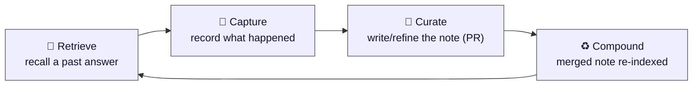
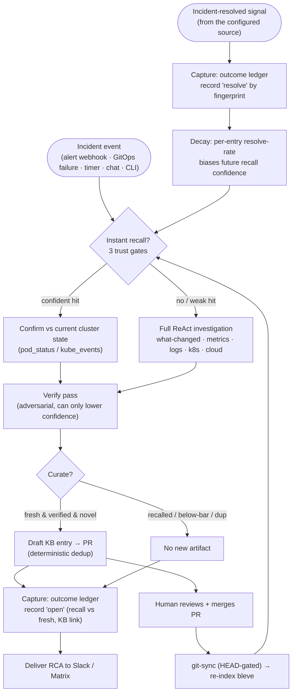
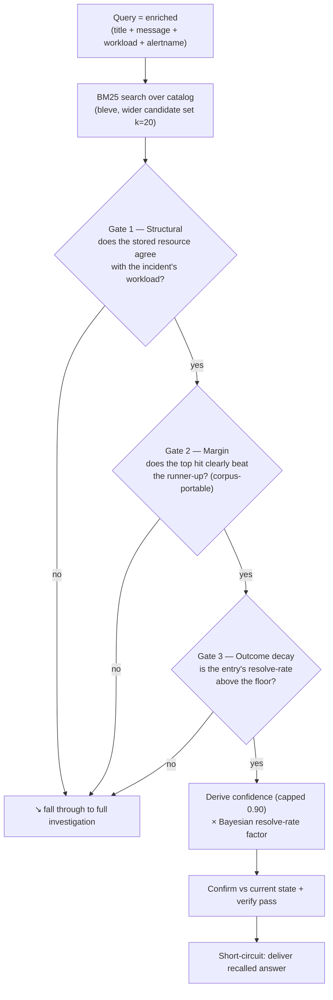
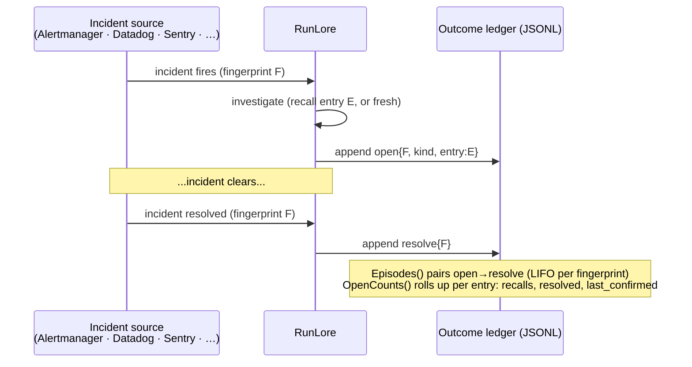
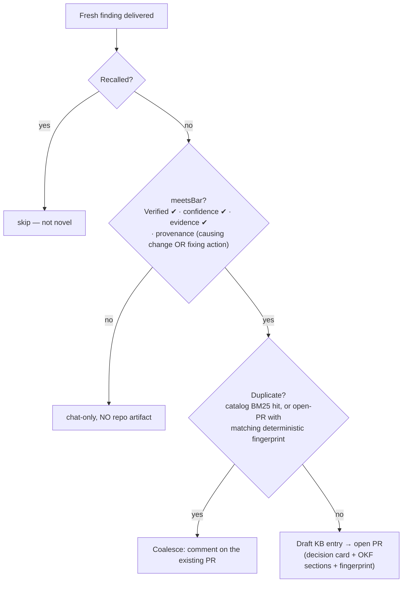
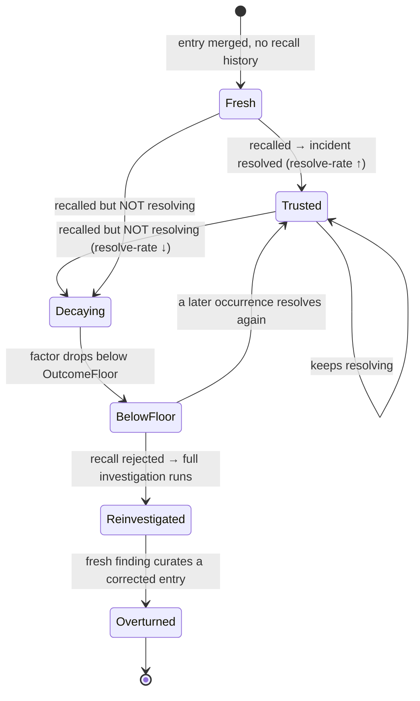

# RunLore's learning loop — how the agent gets better over time

> Companion to [`design.md`](design.md). This document explains the **learning
> loop** specifically: what "learning" means in RunLore, how each stage works, and
> *why* it was built the way it was.

> **TL;DR.** On an incident, RunLore first tries to **recall** a trustworthy past
> answer from a git-versioned catalog — instant, no investigation; otherwise it
> investigates. It then **captures** whether the incident actually resolved,
> **curates** a verified, novel finding into a **human-reviewed pull request**, and
> once a human merges it the note **compounds** (recall-able next time). What makes
> this *learning* and not note-taking: a note's trust is **derived from its real-world
> resolve-rate** (plus 👍/👎 votes), so a note that stops working **decays** and can be
> overturned. And the human stays in the loop throughout — **RunLore drafts, a human
> merges; nothing is auto-written.** (Deep dives: §3 Retrieve, §4 Capture, §6 Decay,
> §8 Validation.)

---

## 1. In plain words

A normal SRE agent answers the same incident from scratch every single time. RunLore
tries to **remember** instead.

When RunLore resolves an incident, it writes a short, structured note — *symptom →
cause → resolution* — into an **open, git-versioned knowledge catalog** (a folder of
markdown files in a Git repo, reviewed via pull request like any other code). The
next time a similar incident fires, RunLore **reads that note back** in milliseconds
instead of re-running a multi-minute investigation. And crucially, it **watches what
happens next**: if the remembered answer was followed by the incident actually
clearing, that note earns trust; if a note keeps getting recalled but the incident
never resolves, that note *loses* trust and eventually stops being used until a fresh
investigation overturns it.

So "learning" here is a loop of four moves:



- **Retrieve** — on a new incident, look for a trustworthy matching note and use it.
- **Capture** — record that this incident happened and whether it then resolved.
- **Curate** — turn a fresh, *verified* finding into a reviewable catalog entry (and
  collapse duplicates).
- **Compound** — once a human merges the PR, the note is re-indexed and becomes
  recall-able for everyone, so the catalog gets denser and the agent faster.

The two things that make this *learning* rather than mere note-taking:

1. **Outcomes feed back.** A recalled note's trust is derived from its real-world
   resolve-rate, not asserted by the model.
2. **Knowledge is communal and provenance-tracked.** Entries live in Git, are
   PR-reviewed, carry the change that caused the incident, and can be overturned.

---

## 2. The loop, end to end

> **The event source is pluggable.** RunLore reacts to an *incident* from whatever
> trigger is configured — an alert webhook (Alertmanager/VMAlert today; a Datadog,
> Sentry, PagerDuty, or other monitor tomorrow), a GitOps reconcile failure, a timer,
> chat, or the CLI. Nothing in the learning loop is bound to a specific source: an
> incident is normalized to a fingerprint + title + (optional) workload at the trigger
> edge, and every stage below — recall, the outcome ledger, curation — operates on
> that normalized shape, never on a source-specific API. Where this doc names
> Alertmanager, read it as "the configured incident source."



Everything below zooms into the four boxes that matter: **Retrieve**, **Capture**,
**Curate**, **Compound** — plus the **feedback edge** (decay) and how we **validate**
the whole thing.

---

## 3. Retrieve — instant recall, but only when it's trustworthy

**Where:** `internal/investigate/recall.go`, wired in `internal/investigate/loop.go`.

The agent never blindly trusts the catalog. A recall short-circuit (answer without
investigating) only fires when a hit clears **three independent gates**, and even
then the answer is confirmed against live state and re-reviewed.

> **First read?** Skip the next two blockquotes and go straight to the **three-gate
> diagram** below — that's the core of recall. The two boxes are opt-in *refinements*
> to how the gate scores a candidate (hybrid embeddings, and the LLM reranker that is
> on by default); come back to them when you want to tune it.

> **Hybrid recall (experimental, opt-in).** With `instant_recall.hybrid` set and a
> `model.embeddings` endpoint configured, the BM25 search below is fused with
> embedding-cosine similarity (Reciprocal Rank Fusion), and Gate 2's margin is measured
> on **cosine** (`hybrid_min_score` / `hybrid_margin_gap`) rather than the BM25 score.
> Default off — with no embedder the catalog stays BM25-only and recall is unchanged.
> The cosine thresholds are conservative placeholders; tune them against the
> instant-recall eval before relying on them.

> **LLM reranker (on by default) — the principled fire gate.** With `instant_recall.rerank`
> set, Gate 2 (the BM25-magnitude margin) is **replaced** by a calibrated
> match-confidence gate. Query enrichment fixed retrieval *ranking* — on the real
> corpus the correct runbook now ranks #1 (Recall@1 = 1.00, MRR 1.00) — but the
> short-circuit still gated on the **absolute** BM25 magnitude (`solo_floor`), and an
> enriched real-corpus score is ~0.1–1.2, an *order of magnitude* below the default
> `solo_floor` 4.0. So recall only fired where an operator hand-tuned `solo_floor` down
> to their corpus's score regime — a fragile gate that does not "just work" at the
> default across clusters. The reranker takes the top-`rerank_k` structurally-agreeing
> candidates, asks the model in **one cheap call** ("which candidate, if any, is the
> correct runbook for THIS incident, and how confident are you?"), and fires only when
> the **calibrated** confidence clears `rerank_threshold` (default 0.7). Because a
> calibrated 0–1 confidence is **corpus-independent**, the same default fires across
> corpora — the BM25 score is demoted to retrieval-ranking-only (pick the top-K).
>
> Measured on the eval harness at default thresholds (`recalleval_test.go`,
> `TestRecallEvalRerankFireRate`):
>
> | | fire-rate (label positives) | precision | negatives fired |
> |---|---|---|---|
> | rerank **off** | 0/11 (0.00) | — | 0/2 |
> | rerank **on** | **11/11 (1.00)** | **1.00** | **0/2** |
>
> **Cost & false-recall discipline.** The reranker runs *before* the "free"
> short-circuit, so it is bounded: one call, `rerank_k` candidates, and only when
> retrieval already surfaced a plausible candidate (a trivial `rerank_min_score` cost
> guard — no call otherwise). It routes to `model.verify` (cheaper/faster) when
> configured, costs ~1–2k tokens, and saves the ~100k of a full investigation when it
> fires. A reranker that hallucinates a match is worse than no recall, so it fails
> **safe**: it only ranks candidates that already passed the structural filter, ignores
> any `entry_id` it did not offer, and treats a "no match", a low confidence, or a
> model error as a fall-through to a full investigation (the negative cases fire on
> **zero** entries). Everything downstream is unchanged — the recalled answer still
> goes through live-state **confirm** and the adversarial **verify** pass. The reranker
> is a *retrieval-time* decision ("which candidate + confident enough to short-circuit"),
> **not** a second verify.



Why each gate exists:

- **BM25, not TF-IDF.** The index is pinned to BM25 scoring
  (`internal/catalog/catalog.go`, `newIndexMapping`). BM25's saturating,
  length-normalized scores are far more corpus-portable, so the *relative margin* gate
  below is meaningful as the catalog grows. (Earlier the index silently ran legacy
  TF-IDF, invalidating every threshold — fixing that was the cheapest high-leverage
  change in the codebase.)
- **Gate 1 — structural agreement** (`resourceAgrees`). The incident names a workload
  (namespace + name, derived from the source's labels — e.g. Alertmanager
  `pod`/`deployment`); the entry stores the resource its incident affected. They must
  agree. This is the lever that separates "many
  symptoms → one cause": a `CrashLoopBackOff` in `apps/web` should not recall an OOM
  runbook for `apps/worker`. It's a **pre-filter** over a wide candidate set (k=20),
  not a check of only the top lexical hit, so the structurally-correct entry can win
  even when a wrong-workload entry scores higher on symptom words. A **workload-less**
  incident (PagerDuty carries no Kubernetes namespace/name) agrees only with entries
  that are themselves resource-less — the weakest ("scopeless") tier: it always
  requires `solo_floor` + `min_score`, starts at reduced confidence, and
  `require_workload_match: true` disables it.
- **Gate 2 — relative margin.** The top agreeing hit must beat the runner-up by a
  configured gap (or clear a solo floor when there's only one). Because BM25 scores
  are corpus-dependent, RunLore trusts the *gap between candidates*, not an absolute
  score.
- **Gate 3 — outcome decay** (see §6). The entry's historical resolve-rate must be
  above a floor; a note that recalls but never resolves is rejected and forces a
  fresh investigation.

Then two safety backstops before the recalled answer is delivered:

- **Confirm against current state** (`internal/investigate/confirm.go`). Before
  trusting a remembered answer, RunLore makes 1–2 cheap, read-only cluster calls
  (`pod_status`, `kube_events`) scoped to the workload's **namespace** — deliberately
  namespace-wide, *not* just the alerting object — so a cause living on a
  **neighbouring resource** (a dependency, an upstream, a Crossplane claim, not the
  pod that alerted) is still confirmed, and appends that *current state* to the
  finding. This is non-LLM and fast. If it can't gather state (no namespace / tools
  absent), the recalled confidence is capped lower (0.70) so an unconfirmable memory
  isn't presented at full confidence.
- **Verify pass** (`internal/investigate/verify.go`). An adversarial reviewer judges
  the finding **only on the evidence given** and can *only lower* confidence. Because
  the confirm step injected real cluster state, verify can now actually catch a stale
  or wrong note (previously it only saw a tautological "matched entry X" string and
  was a no-op on the recall path).

**Confidence is derived, never asserted** (`deriveRecallConfidence`,
`outcomeFactor`): it's a function of the BM25 score, the margin, the structural-match
strength, and the Bayesian-smoothed resolve-rate — and it is **capped at 0.90**. The
agent is structurally unable to claim certainty from memory alone.

**A recall is made visible in the notification** (`internal/notify/`). A short-circuit
would otherwise read as a low-confidence fresh investigation, so a recalled answer leads
with an explicit **⚡ Instant recall** block: "answered from your knowledge base, no
investigation was run", the entry's known cause + human-reviewed resolution, a link to the
catalog entry, and its **resolve-rate track record** (the outcome-ledger signal that makes
the cached answer trustworthy). This is the on-call-facing face of the Compound step (§7).

> **Safety note:** instant recall is *disabled* under autonomy mode `auto`
> (`loop.go`) — a poisoned catalog entry must never short-circuit straight into an
> auto-executed remediation. Recall accelerates *humans*, not unattended actions.

---

## 4. Capture — the outcome ledger (the "did it actually work?" record)

**Where:** `internal/outcome/ledger.go`.

This is the part almost no other open-source SRE agent has: a durable, append-only
record of **whether a recalled answer preceded the incident actually resolving**.

- When an investigation completes, RunLore appends an **`open`** event: the incident's
  fingerprint, whether it was answered by `recall` or a `fresh` investigation, and —
  for recalls — *which catalog entry* was used.
- When the matching **incident-resolved signal** arrives (a resolved-alert webhook
  today; any source's "cleared" event by design), RunLore appends a **`resolve`** event
  for that fingerprint.

The `open` event also now records the incident's **trigger key**, the **curated KB link**
(so a recurrence can surface "previous: <link>"), and the curator's machine **verdict** —
curation runs *before* the ledger open so the KB URL is present on the open itself.



Two read APIs turn this raw log into a learning signal:

- **`Episodes()`** replays the whole ledger and pairs each `resolve` with the most
  recent unresolved `open` for the same fingerprint — so **recurrence is preserved**
  (3 opens + 1 resolve ⇒ 3 episodes, 1 resolved). It is order-independent: a resolve
  that lands *before* its open (a transient incident that cleared mid-investigation)
  is buffered and paired with the next open.
- **`OpenCounts()`** rolls episodes up **per catalog entry**: how many times the entry
  was recalled, how many of those resolved, and when it last resolved.
- **`Occurrences()`** rolls opens up **per trigger key** (a `byTrigger` index folded on
  each open): how many times *this alert* has fired, when the last occurrence was, and the
  KB link from the previous one. The delivery path reads this to stamp **recurrence facts**
  (occurrence count + previous-KB link) onto the notification, so a repeat alert is
  visibly flagged as recurring rather than looking brand-new. When the recurring
  incident's merged entry is findable by dup-fingerprint, the notification also quotes
  the entry's **cause and human-reviewed resolution** inline (with its recall
  resolve-rate), so the previous answer is readable without leaving chat.
- **`Feedback()`** appends a human **`feedback`** event — the 👍/👎 buttons on Slack
  investigation messages (opt-in, `notify.slack.feedback_buttons`) or 👍/👎 **reactions**
  on Matrix ones (opt-in, `notify.matrix.feedback_reactions`, zero-ingress; see
  [configuration.md](configuration.md#notify--where-findings-go)). A vote is attributed
  to the catalog entry behind the trigger key's **newest open** (via the same
  `byTrigger` index; a fresh investigation has no entry, so its votes are recorded but
  weigh nothing), deduplicated to **one live vote per (trigger key, user)** —
  a duplicate click is idempotent, changing your mind *moves* the vote — and folded
  into `OpenCounts()` as per-entry `FeedbackUp` / `FeedbackDown`.

Design choices worth calling out:

- **Append-only JSONL, replayed.** The in-memory open-index is lossy by design (it
  forgets resolved opens); the file is the durable truth. Attribution is robust to
  restarts and to per-fingerprint coalescing (each constituent alert in a coalesced
  storm records its own open so each resolve matches).
- **Durability is opt-in but real.** The ledger (and the hash-chained audit log) can
  be backed by a `ReadWriteMany` PVC so they survive pod restart *and* leader failover
  — otherwise they live on an `emptyDir` and are explicitly ephemeral.

---

## 5. Curate — turning a verified finding into reviewable, deduplicated knowledge

**Where:** `internal/curator/` (file-time) and `internal/curate/` (scheduled Phase-2).

Not every finding deserves to enter the shared catalog. Curation is a gate, not a
firehose.



When there is anything to show, the drafted PR body also carries a *Related knowledge* section — the dedup search's k=5 neighborhood plus the trigger's recurrence line — so the human reviewing the entry sees what the catalog already holds.

The two load-bearing ideas:

- **Quality gate first (`meetsBar`).** A finding reaches the catalog only if it was
  **`Verified`** (it survived the adversarial verify pass with a cause intact),
  *and* it's confident, *and* it cites evidence, *and* it carries **provenance** — a
  causing-change reference (`ChangeRef`) **or** a fixing action (`SuggestedAction`).
  The provenance check is an **OR**, deliberately: requiring a GitOps change for every
  entry would wrongly exclude legitimate non-deploy incidents (saturation, cert
  expiry), and requiring a known fix would exclude honest "we don't know the fix yet"
  entries. A finding with *neither* anchor is a bare symptom restatement and is kept
  out. The gate runs **before** dedup, so a below-bar/unverified finding produces
  **zero** repo artifacts — not even a coalesce comment.
- **Deterministic dedup, not prose matching.** The open-PR dedup keys on a
  `DupFingerprint`, stored both in the entry's YAML frontmatter and as a hidden marker
  in the PR body. Two investigations of *one* incident produce different LLM prose but
  the **same** fingerprint, so the second coalesces onto the first instead of opening a
  duplicate PR. The fingerprint has two branches, deliberately anchored on the most
  stable identity available:
  - **Trigger-keyed (primary).** When the incident carries a `TriggerKey` — an
    alert fingerprint, or a GitOps `resource + condition reason`, i.e. any
    structured, source-emitted signal — the key is
    `sha256(resource-ref + "|trigger:" + triggerKey)`. Re-investigations of one
    ongoing incident reword the LLM's prose cause but share the same trigger, so
    keying on the *trigger identity* (stabler than model prose) is what coalesces
    them. The `"trigger:"` namespace ensures a trigger value can never collide with a
    prose cause from the fallback.
  - **Cause-keyed (fallback).** When there is no trigger key — a triggerless, manual
    `lore investigate "<symptom>"` — it falls back to
    `sha256(resource-ref + "|" + normalized cause token-set)`, the order-independent
    significant-token set of the top root cause. This itself falls back to the raw
    lowercased summary when tokenization would erase a terse/acronym cause (e.g.
    "IO GC"), so two different terse causes on one resource can't collide.

**Phase-2 grooming** (`internal/curate/`, run by the opt-in `lore curate` CronJob)
keeps the backlog healthy on a schedule:

- **Dedup** — collapse near-identical *open* PRs across history (fingerprint match
  first — when both PRs carry a `DupFingerprint` marker they're duplicates iff the
  fingerprints are equal — with Jaccard title-similarity as the fallback for
  markerless legacy PRs), closing the higher-numbered duplicate with a back-reference.
- **Lifecycle** — close stale, unprotected PRs (no forge activity within
  `stale_after`), never touching human-labelled ones, and only after a back-ref
  comment. `stale_after: 0` disables the sweep.

Three further passes are also wired, all **ledger-backed** (they read the outcome
ledger, so they stay source-neutral):

- **Queue** — promote a human-`solved` PR to *ready-to-merge* once its incident has
  resolved. The PR↔incident join is **fingerprint-first**: the PR's `DupFingerprint`
  marker is matched against the resolved episodes' dup-fingerprints (the same value
  the ledger stamps on each open), so a resolved episode flips the PR onto the
  merge-ready queue regardless of the LLM's re-worded title. Exact title match
  (`"KB: " + the incident title`) is only a legacy fallback for markerless,
  hand-filed PRs. A human still merges.
- **Recurrence** — open one *knowledge-gap* issue when an unresolved pattern (the
  affected resource) recurs past `recurrence_threshold`. Idempotent by an existing-issue
  check (the forge's open gap issues are the "already-opened" record), so re-running
  never double-opens — no mutable store.
  - **Closed-unmerged escalation.** When a human closes a drafted KB PR *without
    merging*, that is a deliberate "not KB-worthy". RunLore does **not** reopen it (a
    reopen re-litigates a human "no" and resurrects exactly the entries humans reject).
    Instead the entry's `DupFingerprint` is treated as **suppressed** — derived each run
    from the forge's closed-unmerged `runlore` PRs, so there is still no mutable store —
    and its recurrences are counted *silently* on the fingerprint. Once they cross
    `recurrence_threshold`, Recurrence escalates via a knowledge-gap issue that **links
    the closed PR** and cites the count ("closed unmerged but has recurred N times —
    reconsider?"), respecting the close instead of overriding it. A close labelled
    `needs-work` is a revise-and-resubmit (not a rejection) and is left to the generic
    recurrence path; `wontfix` / `not-kb-worthy` are captured as the escalation's close
    reason. A *merged* PR is an accepted entry and is never suppressed.
- **Contested** — when humans hold standing 👎 votes on the investigation behind a
  *pending* KB entry (a 👎 on a fresh investigation weighs nothing in recall trust —
  there is no catalog entry yet), the pass posts one warning comment on the still-open
  KB PR so the reviewer sees the contest before merging; idempotent via a hidden
  per-trigger marker in the comment, no mutable store.

---

## 6. The feedback edge — outcome-driven decay (what makes it *learn*)

This is the make-or-break: the edge from **Capture** back into **Retrieve**.

`OpenCounts()` gives, per entry, `recalls`, `resolved`, and the human feedback votes
(`FeedbackUp` / `FeedbackDown`). RunLore turns that into a **Bayesian-smoothed success
rate** and multiplies the derived recall confidence by it (`outcomeFactor`, applied in
`recall.go`):

```
            resolved + up + 1
factor  =  -----------------------      (a Beta(1,1) prior — k≈2 — so a brand-new
            recalls + up + down + 2      entry isn't punished for having no history)

confidence  =  clamp( base_confidence × factor , 0 , 0.90 )
```

Human 👍/👎 votes are **extra Bernoulli observations in the same posterior** — a 👍 is
one success, a 👎 one failure, each weighing exactly like a resolved/unresolved recall.
That matters most where the resolve signal *cannot exist*: sources with no resolve
channel (**GitOps failures**, reinvestigate polls, Alertmanager without `send_resolved`)
are deliberately excluded from resolve-based decay, so without feedback their entries'
trust is frozen at the prior forever. A human's explicit 👎 (a Slack click or a Matrix
reaction) is the only ground truth those paths can ever accumulate — and it is a
judgment on the *diagnosis itself*, which an
alert merely clearing never proves.



The effect: a note that consistently precedes resolution stays trusted; a **stale or
poisoned** note that recalls-but-never-resolves decays below the floor, gets rejected
at Gate 3, triggers a fresh investigation, and can be **overturned** by a corrected
entry. Decay is **outcome/contradiction-driven, never pure mtime** — knowledge ages
out because it stops working, not merely because it's old.

This is the answer to the hardest objection against KB-backed agents ("what happens
when a confidently-worded wrong belief gets in?"): the loop has a mechanism to lose
trust in it and overturn it.

The same per-trigger index also powers the **recurrence cooldown**
(`investigation.recurrence_cooldown`, opt-in): a trigger the agent conclusively
answered moments ago is not re-investigated — no model call, no duplicate
notification — until the cooldown lapses. The escape hatches are human-deferential
by design: an `inconclusive` prior never suppresses (there is no answer worth
repeating), and a standing 👎 on the trigger re-arms investigation immediately. So
feedback does two jobs: it weighs *recalled knowledge* (the decay above) and it
governs *when the agent may repeat itself* — both steered by the same single
human 👍/👎 signal.

The re-arm holds across the outer noise-control layers too — with one boundary.
The **coalescer's cooldown** (`investigation.coalesce.cooldown`, 10m default when
enabled) consults the same standing-👎 signal and lets a contested trigger through
instead of absorbing it as storm noise, so the layers cannot silently defer the
re-arm. **Fingerprint dedup** (`triggers.incidents.dedup.window`) is the exception:
it keys on the Alertmanager fingerprint before feedback is ever consulted, so a
*still-firing* alert re-sent with the same fingerprint inside the dedup window is
dropped regardless of a standing 👎. Precisely: a 👎 re-arms investigation at the
next occurrence that clears fingerprint dedup — a re-fire with a fresh fingerprint
(changed label set) immediately, a same-fingerprint repeat once the dedup window
(code default **0** = off; chart ships **30m**) has lapsed.

---

## 7. Compound — merged knowledge becomes everyone's, fast

**Where:** `internal/catalog/sync.go` + the readiness gate in `cmd/lore/main.go` /
`internal/server/server.go`.

A merged PR only helps if the running agent actually re-indexes it. RunLore keeps a
local Git mirror of the catalog and re-indexes on change:

- **HEAD-gated re-index.** The syncer tracks the last-synced commit hash and only
  rebuilds the in-memory BM25 index when the remote HEAD **actually moved** — not on
  every poll. A curator-merged PR moves HEAD → the next poll rebuilds exactly once.
  This runs on **every replica** (so a failover standby is already warm) and the
  per-poll rebuild cost is gone.
- **Readiness reflects warmth.** A replica doesn't advertise `/readyz` healthy until
  its catalog has loaded at least once, so it isn't routed incident traffic before its
  knowledge base is warm (a ConfigMap-mounted static catalog is ready immediately; a
  git-sync catalog becomes ready after its first index). Readiness is warmth only —
  leadership is handled by request forwarding, not by keeping standbys NotReady.

The compounding rate is ultimately bounded by **how fast humans merge PRs** — which is
deliberate. The catalog is a reviewed commons, not an auto-writing cache; the
propose-and-approve boundary is the safety property, and Phase-2 grooming exists to
keep that human queue tractable.

---

## 8. Validation — how we know any of this works

**Where:** `internal/eval/`, plus the nightly `.github/workflows/eval.yaml`.

Claims about a learning loop are worthless without measurement, so RunLore ships an
eval harness and treats its outputs as the source of truth:

- **Deterministic entity-precision scoring (Track A).** Beyond a fuzzy LLM-judge
  score, the harness checks whether the named root-cause *entities* are present and
  penalizes **over-claiming** (blaming plausible-but-wrong distractors) — the dominant
  failure mode strong models exhibit.
- **Statistical gating.** Reported runs use N≥10 with a **k-of-n** pass rule and a
  variance/flaky guard, so a verdict is a measurement, not a coin flip.
- **The closed loop is exercised in eval.** A poisoned-entry scenario proves a crafted
  wrong recall is *caught* by the verify pass — the poisoned answer is withdrawn and the
  agent **falls through to a real investigation** rather than publishing it — not just
  that the agent organically searched the KB.
- **CI.** A nightly (+ manual) workflow runs the replay eval with a fail-under gate
  and uploads the report; it's intentionally *not* a per-PR blocker (it drives a live
  model and can't run on fork PRs), while the deterministic scoring logic is unit-
  tested on every PR.

---

## 9. Design choices & rationale (at a glance)

| Choice | Why |
|---|---|
| **Derived, capped (≤0.90) recall confidence** | The agent must be unable to assert certainty from memory; trust is computed from score + margin + structural match + resolve-rate, never claimed. |
| **Relative margin gate (not an absolute score floor)** | BM25 scores are corpus-dependent; the *gap between candidates* stays meaningful as the catalog grows. |
| **Structural agreement as a pre-filter over wide-k** | Separates many-symptoms→one-cause; the right entry can win even when wrong-workload entries score higher on symptom words. |
| **Confirm vs current state before trusting a recall** | Lets the verify pass judge a remembered answer against reality, so a stale note is caught instead of rubber-stamped. |
| **Verify can only *lower* confidence** | A safety review must never manufacture confidence; worst case it's a no-op, never a promoter. |
| **Outcome-driven decay (never pure mtime)** | Knowledge ages out because it stops working, giving a concrete mechanism to overturn a confidently-wrong belief. |
| **Append-only JSONL ledger, replayed** | Robust, restart-safe attribution; preserves recurrence and tolerates out-of-order resolves. |
| **Deterministic dedup fingerprint** | Prose titles vary per run; a hash keyed on the incident's trigger identity (`resource+trigger`, primary) — or `resource+cause` for triggerless manual runs — makes "same incident" detectable and stops duplicate-PR floods. |
| **`meetsBar` before dedup; Verified + provenance required** | The shared, communal catalog only accepts adversarially-reviewed, actionable knowledge — and a below-bar finding produces *zero* repo artifacts. |
| **Provenance is OR (causing change ∨ fixing action)** | Avoids wrongly excluding non-GitOps incidents while still rejecting bare symptom restatements. |
| **Recall disabled under `auto`** | A poisoned entry must never short-circuit into an unattended remediation. |
| **PR-reviewed, git-versioned catalog** | The propose-and-approve human boundary *is* the safety model; provenance + reviewability are the durable, communal moat. |
| **HEAD-gated re-index + readiness-on-warmth** | Compounds merged knowledge promptly without wasteful per-poll rebuilds, and keeps a cold leader out of rotation. |
| **Eval: entity precision + k-of-n + poisoned-entry + CI** | Every learning claim is measured deterministically and statistically, and the closed loop is exercised, not assumed. |

---

## 10. Where it's deliberately incomplete

Honesty is part of the design:

- **Reversible `rollback` remediation** was scoped and **deliberately declined**: an
  in-cluster re-pin of a Flux Kustomization must patch a shared GitRepository in the
  protected `flux-system` namespace and diverges the cluster from Git. Remediation
  stays read-only / propose-and-approve; `auto` executes only suspend/resume/reconcile,
  and the agent *suggests* (never auto-applies) a rollback. The GitOps-correct form, if
  ever revisited, is a Git-revert PR. (See `design.md`, "Act".)
- The **Queue/Recurrence precision tradeoff**: the resolution join is now
  fingerprint-first (the PR's `DupFingerprint` against resolved episodes), so the
  coarse exact-title join — which can fire a human-gated promotion slightly early on
  coalesced or cross-namespace incidents — only applies to legacy/hand-filed PRs that
  carry no fingerprint marker.
- **Nightly eval** only produces signal once a model API-key secret is configured.

The loop is closed and measured; these are the next increments, sequenced so each is
its own reviewed change.

---

*Code anchors:* recall `internal/investigate/recall.go`; confirm
`internal/investigate/confirm.go`; verify `internal/investigate/verify.go`; ledger
`internal/outcome/ledger.go`; curation `internal/curator/` + `internal/curate/`;
catalog/sync `internal/catalog/`; eval `internal/eval/`.
