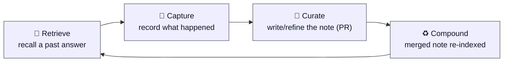
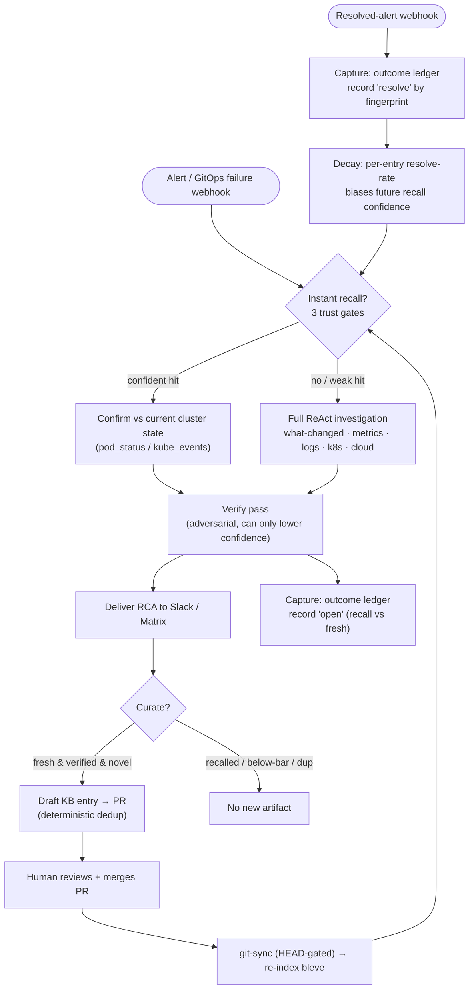
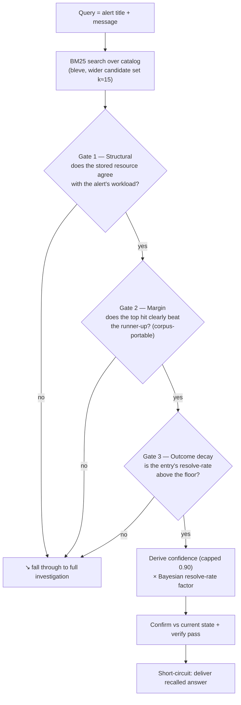
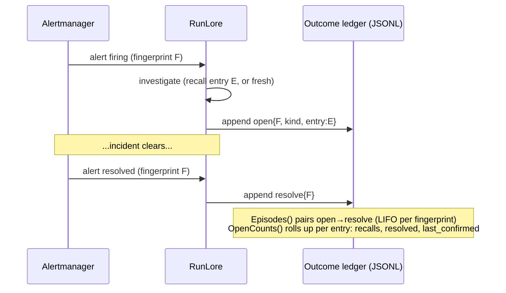
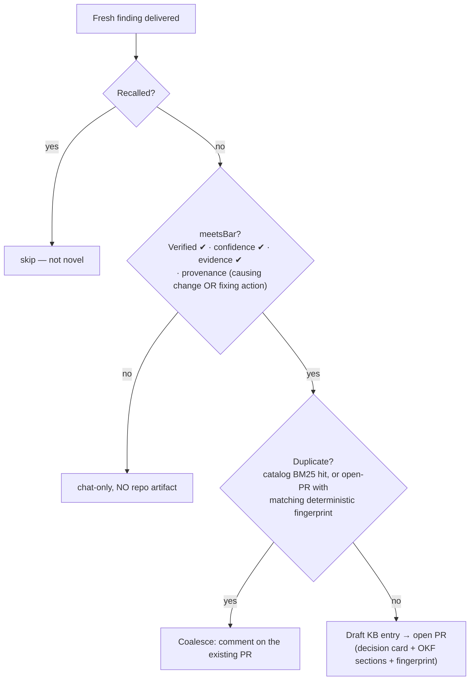
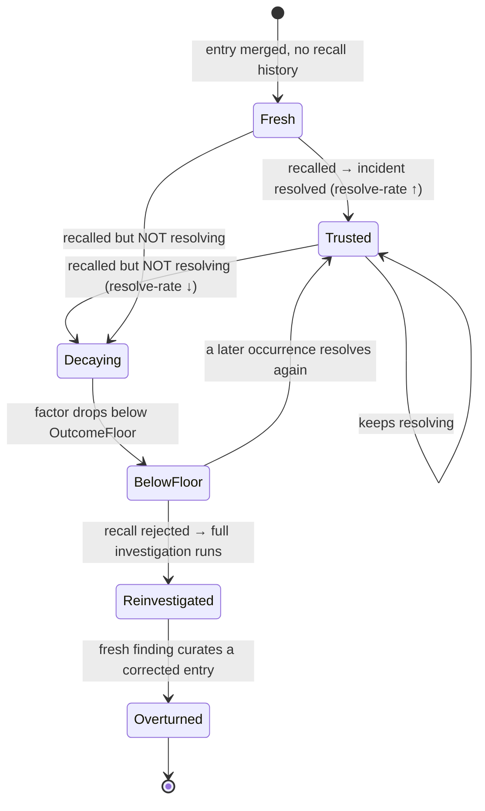

# RunLore's learning loop — how the agent gets better over time

> Companion to [`design.md`](design.md). This document explains the **learning
> loop** specifically: what "learning" means in RunLore, how each stage works, and
> *why* it was built the way it was. It reflects the system after the 2026-06-23
> roadmap batch (instant-recall trust, outcome ledger + decay, curation gates,
> scheduled grooming, sync/readiness hardening, and the eval harness).

---

## 1. In plain words

A normal SRE agent answers the same incident from scratch every single time. RunLore
tries to **remember** instead.

When RunLore resolves an incident, it writes a short, structured note — *symptom →
cause → resolution* — into an **open, git-versioned knowledge catalog** (a folder of
markdown files in a Git repo, reviewed via pull request like any other code). The
next time a similar incident fires, RunLore **reads that note back** in milliseconds
instead of re-running a multi-minute investigation. And crucially, it **watches what
happens next**: if the remembered answer was followed by the incident actually
clearing, that note earns trust; if a note keeps getting recalled but the incident
never resolves, that note *loses* trust and eventually stops being used until a fresh
investigation overturns it.

So "learning" here is a loop of four moves:



- **Retrieve** — on a new incident, look for a trustworthy matching note and use it.
- **Capture** — record that this incident happened and whether it then resolved.
- **Curate** — turn a fresh, *verified* finding into a reviewable catalog entry (and
  collapse duplicates).
- **Compound** — once a human merges the PR, the note is re-indexed and becomes
  recall-able for everyone, so the catalog gets denser and the agent faster.

The two things that make this *learning* rather than mere note-taking:

1. **Outcomes feed back.** A recalled note's trust is derived from its real-world
   resolve-rate, not asserted by the model.
2. **Knowledge is communal and provenance-tracked.** Entries live in Git, are
   PR-reviewed, carry the change that caused the incident, and can be overturned.

---

## 2. The loop, end to end



Everything below zooms into the four boxes that matter: **Retrieve**, **Capture**,
**Curate**, **Compound** — plus the **feedback edge** (decay) and how we **validate**
the whole thing.

---

## 3. Retrieve — instant recall, but only when it's trustworthy

**Where:** `internal/investigate/recall.go`, wired in `internal/investigate/loop.go`.

The agent never blindly trusts the catalog. A recall short-circuit (answer without
investigating) only fires when a hit clears **three independent gates**, and even
then the answer is confirmed against live state and re-reviewed.



Why each gate exists:

- **BM25, not TF-IDF.** The index is pinned to BM25 scoring
  (`internal/catalog/catalog.go`, `newIndexMapping`). BM25's saturating,
  length-normalized scores are far more corpus-portable, so the *relative margin* gate
  below is meaningful as the catalog grows. (Earlier the index silently ran legacy
  TF-IDF, invalidating every threshold — fixing that was the cheapest high-leverage
  change in the codebase.)
- **Gate 1 — structural agreement** (`resourceAgrees`). The alert names a workload
  (namespace + name, derived from Alertmanager labels); the entry stores the resource
  its incident affected. They must agree. This is the lever that separates "many
  symptoms → one cause": a `CrashLoopBackOff` in `apps/web` should not recall an OOM
  runbook for `apps/worker`. It's a **pre-filter** over a wide candidate set (≈15),
  not a check of only the top lexical hit, so the structurally-correct entry can win
  even when a wrong-workload entry scores higher on symptom words.
- **Gate 2 — relative margin.** The top agreeing hit must beat the runner-up by a
  configured gap (or clear a solo floor when there's only one). Because BM25 scores
  are corpus-dependent, RunLore trusts the *gap between candidates*, not an absolute
  score.
- **Gate 3 — outcome decay** (see §6). The entry's historical resolve-rate must be
  above a floor; a note that recalls but never resolves is rejected and forces a
  fresh investigation.

Then two safety backstops before the recalled answer is delivered:

- **Confirm against current state** (`internal/investigate/confirm.go`). Before
  trusting a remembered answer, RunLore makes 1–2 cheap, read-only cluster calls
  (`pod_status`, `kube_events`) scoped to the workload and appends that *current
  state* to the finding. This is non-LLM and fast. If it can't gather state (no
  namespace / tools absent), the recalled confidence is capped lower (0.70) so an
  unconfirmable memory isn't presented at full confidence.
- **Verify pass** (`internal/investigate/verify.go`). An adversarial reviewer judges
  the finding **only on the evidence given** and can *only lower* confidence. Because
  the confirm step injected real cluster state, verify can now actually catch a stale
  or wrong note (previously it only saw a tautological "matched entry X" string and
  was a no-op on the recall path).

**Confidence is derived, never asserted** (`deriveRecallConfidence`,
`outcomeFactor`): it's a function of the BM25 score, the margin, the structural-match
strength, and the Bayesian-smoothed resolve-rate — and it is **capped at 0.90**. The
agent is structurally unable to claim certainty from memory alone.

> **Safety note:** instant recall is *disabled* under autonomy mode `auto`
> (`loop.go`) — a poisoned catalog entry must never short-circuit straight into an
> auto-executed remediation. Recall accelerates *humans*, not unattended actions.

---

## 4. Capture — the outcome ledger (the "did it actually work?" record)

**Where:** `internal/outcome/ledger.go`.

This is the part almost no other open-source SRE agent has: a durable, append-only
record of **whether a recalled answer preceded the incident actually resolving**.

- When an investigation completes, RunLore appends an **`open`** event: the incident's
  fingerprint, whether it was answered by `recall` or a `fresh` investigation, and —
  for recalls — *which catalog entry* was used.
- When the matching **resolved-alert webhook** arrives, RunLore appends a **`resolve`**
  event for that fingerprint.



Two read APIs turn this raw log into a learning signal:

- **`Episodes()`** replays the whole ledger and pairs each `resolve` with the most
  recent unresolved `open` for the same fingerprint — so **recurrence is preserved**
  (3 opens + 1 resolve ⇒ 3 episodes, 1 resolved). It is order-independent: a resolve
  that lands *before* its open (a transient incident that cleared mid-investigation)
  is buffered and paired with the next open.
- **`OpenCounts()`** rolls episodes up **per catalog entry**: how many times the entry
  was recalled, how many of those resolved, and when it last resolved.

Design choices worth calling out:

- **Append-only JSONL, replayed.** The in-memory open-index is lossy by design (it
  forgets resolved opens); the file is the durable truth. Attribution is robust to
  restarts and to per-fingerprint coalescing (each constituent alert in a coalesced
  storm records its own open so each resolve matches).
- **Durability is opt-in but real.** The ledger (and the hash-chained audit log) can
  be backed by a `ReadWriteMany` PVC so they survive pod restart *and* leader failover
  — otherwise they live on an `emptyDir` and are explicitly ephemeral.

---

## 5. Curate — turning a verified finding into reviewable, deduplicated knowledge

**Where:** `internal/curator/` (file-time) and `internal/curate/` (scheduled Phase-2).

Not every finding deserves to enter the shared catalog. Curation is a gate, not a
firehose.



The two load-bearing ideas:

- **Quality gate first (`meetsBar`).** A finding reaches the catalog only if it was
  **`Verified`** (it survived the adversarial verify pass with a cause intact),
  *and* it's confident, *and* it cites evidence, *and* it carries **provenance** — a
  causing-change reference (`ChangeRef`) **or** a fixing action (`SuggestedAction`).
  The provenance check is an **OR**, deliberately: requiring a GitOps change for every
  entry would wrongly exclude legitimate non-deploy incidents (saturation, cert
  expiry), and requiring a known fix would exclude honest "we don't know the fix yet"
  entries. A finding with *neither* anchor is a bare symptom restatement and is kept
  out. The gate runs **before** dedup, so a below-bar/unverified finding produces
  **zero** repo artifacts — not even a coalesce comment.
- **Deterministic dedup, not prose matching.** The open-PR dedup keys on a
  `DupFingerprint` — `sha256(resource-ref + "|" + normalized cause token-set)` —
  stored both in the entry's YAML frontmatter and as a hidden marker in the PR body.
  Two investigations of *one* incident produce different LLM prose but the **same**
  fingerprint, so the second coalesces onto the first instead of opening a duplicate
  PR. (The fingerprint falls back to the raw cause text when tokenization would
  otherwise erase a terse/acronym cause, so two different terse causes on one resource
  can't collide.)

**Phase-2 grooming** (`internal/curate/`, run by the opt-in `lore curate` CronJob)
keeps the backlog healthy on a schedule:

- **Dedup** — collapse near-identical *open* PRs across history (Jaccard over titles),
  closing the higher-numbered duplicate with a back-reference.
- **Lifecycle** — close stale, unprotected PRs (no forge activity within
  `stale_after`), never touching human-labelled ones, and only after a back-ref
  comment. `stale_after: 0` disables the sweep.

> Two further passes — **Queue** (promote a PR to *ready-to-merge* once its incident
> has resolved) and **Recurrence** (open a *knowledge-gap* issue when a pattern recurs
> unresolved N times) — are implemented and unit-tested but **deferred from wiring**:
> each needs a genuine design decision (an incident↔PR resolution join; an idempotent
> ledger-backed driver) rather than mechanical plumbing.

---

## 6. The feedback edge — outcome-driven decay (what makes it *learn*)

This is the make-or-break: the edge from **Capture** back into **Retrieve**.

`OpenCounts()` gives, per entry, `recalls` and `resolved`. RunLore turns that into a
**Bayesian-smoothed resolve-rate** and multiplies the derived recall confidence by it
(`outcomeFactor`, applied in `recall.go`):

```
            resolved + 1
factor  =  --------------          (a Beta(1,1) prior — k≈2 — so a brand-new
            recalls  + 2            entry isn't punished for having no history)

confidence  =  clamp( base_confidence × factor , 0 , 0.90 )
```



The effect: a note that consistently precedes resolution stays trusted; a **stale or
poisoned** note that recalls-but-never-resolves decays below the floor, gets rejected
at Gate 3, triggers a fresh investigation, and can be **overturned** by a corrected
entry. Decay is **outcome/contradiction-driven, never pure mtime** — knowledge ages
out because it stops working, not merely because it's old.

This is the answer to the hardest objection against KB-backed agents ("what happens
when a confidently-worded wrong belief gets in?"): the loop has a mechanism to lose
trust in it and overturn it.

---

## 7. Compound — merged knowledge becomes everyone's, fast

**Where:** `internal/catalog/sync.go` + the readiness gate in `cmd/lore/main.go` /
`internal/server/server.go`.

A merged PR only helps if the running agent actually re-indexes it. RunLore keeps a
local Git mirror of the catalog and re-indexes on change:

- **HEAD-gated re-index.** The syncer tracks the last-synced commit hash and only
  rebuilds the in-memory BM25 index when the remote HEAD **actually moved** — not on
  every poll. A curator-merged PR moves HEAD → the next poll rebuilds exactly once.
  This runs on **every replica** (so a failover standby is already warm) and the
  per-poll rebuild cost is gone.
- **Readiness reflects warmth.** A leader doesn't advertise `/readyz` healthy until
  its catalog has loaded at least once, so it isn't routed incident traffic before its
  knowledge base is warm (a ConfigMap-mounted static catalog is ready immediately; a
  git-sync catalog becomes ready after its first index).

The compounding rate is ultimately bounded by **how fast humans merge PRs** — which is
deliberate. The catalog is a reviewed commons, not an auto-writing cache; the
propose-and-approve boundary is the safety property, and Phase-2 grooming exists to
keep that human queue tractable.

---

## 8. Validation — how we know any of this works

**Where:** `internal/eval/`, plus the nightly `.github/workflows/eval.yaml`.

Claims about a learning loop are worthless without measurement, so RunLore ships an
eval harness and treats its outputs as the source of truth:

- **Deterministic entity-precision scoring (Track A).** Beyond a fuzzy LLM-judge
  score, the harness checks whether the named root-cause *entities* are present and
  penalizes **over-claiming** (blaming plausible-but-wrong distractors) — the dominant
  failure mode strong models exhibit.
- **Statistical gating.** Reported runs use N≥10 with a **k-of-n** pass rule and a
  variance/flaky guard, so a verdict is a measurement, not a coin flip.
- **The closed loop is exercised in eval.** A poisoned-entry scenario proves the
  *short-circuit actually fires* and that a crafted wrong recall is caught — not just
  that the agent organically searched the KB.
- **CI.** A nightly (+ manual) workflow runs the replay eval with a fail-under gate
  and uploads the report; it's intentionally *not* a per-PR blocker (it drives a live
  model and can't run on fork PRs), while the deterministic scoring logic is unit-
  tested on every PR.

---

## 9. Design choices & rationale (at a glance)

| Choice | Why |
|---|---|
| **Derived, capped (≤0.90) recall confidence** | The agent must be unable to assert certainty from memory; trust is computed from score + margin + structural match + resolve-rate, never claimed. |
| **Relative margin gate (not an absolute score floor)** | BM25 scores are corpus-dependent; the *gap between candidates* stays meaningful as the catalog grows. |
| **Structural agreement as a pre-filter over wide-k** | Separates many-symptoms→one-cause; the right entry can win even when wrong-workload entries score higher on symptom words. |
| **Confirm vs current state before trusting a recall** | Lets the verify pass judge a remembered answer against reality, so a stale note is caught instead of rubber-stamped. |
| **Verify can only *lower* confidence** | A safety review must never manufacture confidence; worst case it's a no-op, never a promoter. |
| **Outcome-driven decay (never pure mtime)** | Knowledge ages out because it stops working, giving a concrete mechanism to overturn a confidently-wrong belief. |
| **Append-only JSONL ledger, replayed** | Robust, restart-safe attribution; preserves recurrence and tolerates out-of-order resolves. |
| **Deterministic dedup fingerprint** | Prose titles vary per run; a `resource+cause` hash makes "same incident" detectable and stops duplicate-PR floods. |
| **`meetsBar` before dedup; Verified + provenance required** | The shared, communal catalog only accepts adversarially-reviewed, actionable knowledge — and a below-bar finding produces *zero* repo artifacts. |
| **Provenance is OR (causing change ∨ fixing action)** | Avoids wrongly excluding non-GitOps incidents while still rejecting bare symptom restatements. |
| **Recall disabled under `auto`** | A poisoned entry must never short-circuit into an unattended remediation. |
| **PR-reviewed, git-versioned catalog** | The propose-and-approve human boundary *is* the safety model; provenance + reviewability are the durable, communal moat. |
| **HEAD-gated re-index + readiness-on-warmth** | Compounds merged knowledge promptly without wasteful per-poll rebuilds, and keeps a cold leader out of rotation. |
| **Eval: entity precision + k-of-n + poisoned-entry + CI** | Every learning claim is measured deterministically and statistically, and the closed loop is exercised, not assumed. |

---

## 10. Where it's deliberately incomplete

Honesty is part of the design:

- **Queue / Recurrence Phase-2 passes** are built + tested but not yet wired — they
  need real product decisions (incident↔PR resolution join; idempotent recurrence
  driver), not mechanical wiring.
- **Reversible `rollback` remediation** (re-pin a Kustomization/HelmRelease to the
  prior revision) is not yet built; `auto` today can only suspend/resume/reconcile.
- **Nightly eval** only produces signal once a model API-key secret is configured.

The loop is closed and measured; these are the next increments, sequenced so each is
its own reviewed change.

---

*Code anchors:* recall `internal/investigate/recall.go`; confirm
`internal/investigate/confirm.go`; verify `internal/investigate/verify.go`; ledger
`internal/outcome/ledger.go`; curation `internal/curator/` + `internal/curate/`;
catalog/sync `internal/catalog/`; eval `internal/eval/`.
