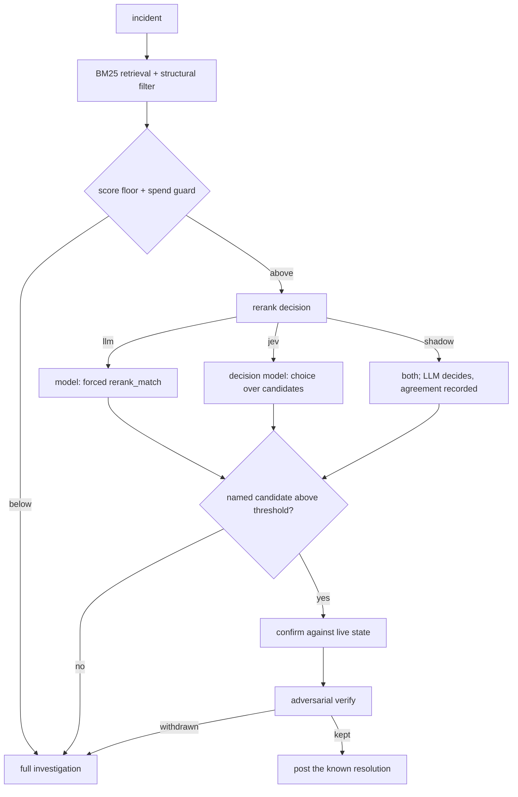

# Design — a decision provider: typed decisions for the gates that only need one

- **Date:** 2026-09-22
- **Status:** Approved (brainstorming)
- **Owner:** Smaine Kahlouch
- **Adds:** a `Decider` provider kind under a top-level `decision_model:` block, one implementation
  (TypeSafe Jev), and two consumers
- **Touches:** `internal/providers/providers.go`, `internal/decide/` (new), `internal/investigate/rerank.go`,
  `internal/curator/curator.go`, `internal/config/config.go`, `internal/telemetry/metrics.go`,
  `internal/eval/` (shadow reporting)

## Problem

Several RunLore gates do not need a language model. They need one bounded judgement with a
trustworthy confidence attached: *is this the right runbook for this incident?*, *is this finding the
same pattern as that entry?* Today each is an LLM call that forces a named tool and parses the
arguments back, which costs a round trip, depends on the endpoint honouring forced `tool_choice`
([#391](https://github.com/Smana/runlore/issues/391) is exactly that failure), and asks the model to
*assert* a calibrated confidence rather than deriving one.

A System One model answers that shape natively. It takes a state plus typed questions and returns
typed values with a probability distribution and a confidence computed from the spread. It generates
no text, so content embedded in an alert or a runbook cannot instruct it.

The scope here is deliberately narrow: the gates that are already one call and already gate on a
threshold. The investigation loop, the adversarial verify pass and every text-producing path stay on
the model provider.

## Decisions (locked during brainstorming)

| Decision | Choice | Rationale |
|---|---|---|
| Provider shape | **A new `Decider` kind, not a `ModelProvider`** | Jev takes typed questions and returns typed answers. Forcing it behind `Complete` would mean synthesising a fake tool call and throwing the probabilities away, which is the exact mismatch this buys us out of |
| Client | **Hand-rolled, modelled on `internal/embed`** | The established precedent for non-chat inference here: plain JSON over `httpx.SecureClient` with `DoWithRetry`. TypeSafe ships no Go SDK, so this is also the only option that keeps the single static binary |
| First consumers | **Recall reranker and curation dedup** | Both are one call, both already gate on a threshold, both fail safe today. The semantic KB advisory follows if it costs nothing extra |
| Reranker rollout | **`shadow` before `jev`** | The reranker sits in front of the recall short-circuit on every incident. Shadow mode measures agreement on live traffic while the LLM keeps deciding |
| Reranker failure | **Fall through to a full investigation** | Identical to today's LLM-reranker failure path. One backend per call, no hidden second call, no circuit breaker to test |
| Dedup verdict | **Three tiers: skip, annotate, file** | A confident duplicate is skipped and recorded as a confirmation; a middling one is filed *with the suspect named in the body* so the reviewer decides; a low one files as today |
| Config placement | **Top-level `decision_model:`, never under `model:`** | It is a different wire protocol from a different vendor answering a different question. Nesting it under `model:` would invite an operator to read it as another LLM endpoint and to expect `max_tokens`, `effort` or `thinking` to mean something there. `model.embeddings` is the counter-precedent, but that serves the model layer alone |
| Switch | **An explicit `enabled` flag, not block presence** | `model.verify` and `model.chat` use presence as the switch, which is fine for a block an operator sets once. This one needs to be turnable **off in a hurry** without deleting the endpoint and key-env config, so it follows `sources.gitops` and `catalog.instant_recall` instead |
| Credentials | **`api_key_env`, the env var NAME** | `configmap.yaml` renders the whole `config:` block verbatim (`toYaml`), so a literal key in config lands in a **ConfigMap** in plaintext rather than a Secret. Every existing provider takes `api_key_env` for exactly this reason |
| Default | **Off** | Every consumer keeps its current backend as the default. Nothing changes until an operator opts in |

## Non-goals

- **Per-incident model routing.** The one lever that would materially cut spend, and the one that
  restructures the loop for two investigation models. Its own spec.
- **Replacing the adversarial verify pass.** It is the gate against plausible-but-wrong, which is
  reasoning, and a System One model can be wrong at high confidence like any other.
- **Anything in the trigger policy or the coalescer.** Both are deterministic, free and instant. A
  network call per alert would make the cheap path slower and add egress before any filter runs.
- **Anything in the action gate.** Reversibility, blast radius and target are validated server-side
  from the op. No model of any kind belongs there.

## Where it sits



Only the rerank decision changes. The guards before it and the two gates after it are untouched,
which is what keeps a wrong Jev answer from reaching a human.

## The contract

```go
// Decider answers bounded, typed questions about a state — no generation.
type Decider interface {
    Decide(ctx context.Context, state string, qs []Question) (Answers, error)
}
```

`Question` carries an id, a kind (`choice`, `score`, `noul`), instructions and criteria. `Answers`
maps each id to its chosen value, the full probability distribution, and a confidence in `[0,1]`.
Questions in one request are evaluated independently against the same state, so a consumer that needs
two judgements pays for one round trip.

The interface lives beside the other provider contracts in `internal/providers/providers.go`. The
implementation lives in `internal/decide/typesafe/`, with the wire types unexported.

## The reranker

`catalog.instant_recall.rerank_backend` takes `llm` (default, today's behaviour), `jev`, or `shadow`.

The question is one `choice` over the candidate entry ids plus an explicit `none` option, carrying the
existing prompt's rules: match on topical fit rather than proving the cause, and a wrong match is
worse than no match. The fire gate keeps its shape, a named candidate at or above a confidence bar,
and the false-recall guard is unchanged: an id outside the candidate set, an error, or `none` all fall
through.

**Thresholds are per backend and not comparable.** `rerank_threshold` (default 0.7) continues to
govern the LLM backend. `rerank_threshold_jev` governs Jev and has **no default**; it is required when
the backend is `jev`. Shadow mode does not need it: it records the confidence distribution in a
histogram, which is how the value gets chosen in the first place.

Shadow mode makes both calls, keeps the LLM's verdict, and records agreement. It doubles the rerank
cost while enabled, which is the point of it being a mode rather than the default.

Two new metrics, following the existing recall naming:

| Metric | Shape |
|---|---|
| `runlore_decision_model_confidence` | Histogram of returned confidence, labelled by consumer. The distribution a threshold is read off |
| `runlore_decision_model_shadow_total` | Counter labelled `consumer` and `agreement` (`agree`, `disagree`, `error`) |

## Curation dedup

One `noul` question: do these two entries describe the same incident pattern? The exact-fingerprint
check runs first and is unchanged, because it needs no threshold.

| Confidence | Action |
|---|---|
| High | Do not file. Record a confirmation, exactly as a fingerprint match does today |
| Middling | File the PR, naming the suspected duplicate in the body |
| Low | File as today |

The two band edges are config, not constants, and both are **required when `dedup_backend` is `jev`**,
for the same reason the reranker's threshold is: a default nobody measured would be invented, not
chosen. This replaces the `dup_score` BM25 gate, which `curator.go` already documents as inert: on a fifty-entry
catalog measured 2026-08-14 the scores run below 1.0 against a default of 5.0, and RunLore re-filed an
entry for a fault the catalog already held.

## Config

A **decision model is not an LLM**, and the config has to say so at a glance. It gets its own
top-level block, and it deliberately carries none of `model:`'s vocabulary: no `max_tokens`, no
`effort`, no `thinking`. None of them mean anything to a model that emits no tokens.

```yaml
decision_model:                       # a System One model: typed questions in, typed answers out.
  enabled: true                       #   NOT an LLM, and deliberately not nested under model:
  provider: typesafe                  # the only implementation for now
  base_url: https://api.typesafe.ai
  model: jev-latest
  api_key_env: TYPESAFE_API_KEY       # the env var NAME. Never the key itself — see below
catalog:
  instant_recall:
    rerank_backend: shadow            # llm (default) | jev | shadow
    # rerank_threshold_jev: omitted on purpose here. shadow does not read it;
    # it is required only once rerank_backend becomes jev.
curation:
  dedup_backend: bm25                 # bm25 (default) | jev
  # dedup_skip_above / dedup_annotate_above: required once dedup_backend is jev
```

**Never a literal key.** `deploy/helm/runlore/templates/configmap.yaml` renders the whole `config:`
block verbatim, so an `api_key` field would put the credential in a **ConfigMap** in plaintext,
readable by anyone with `get configmaps` and absent from every Secret-handling path the chart has.
`api_key_env` names the variable instead, which is what every other provider here takes. An empty
value means keyless, for a gateway that injects the credential itself.

**`enabled: false` wins, and it does not error.** The obvious design is to reject a config whose
consumer points at `jev` while the block is disabled. That is wrong: the flag exists so an operator
can stop every decision call *during an incident* without also editing two consumer keys, and a
validation error at startup would make the kill switch useless exactly when it is needed. So a
disabled block makes every consumer fall back to its default backend, and the fallback is logged
once per consumer at startup, naming each one.

| Outcome at load | Case |
|---|---|
| **Error** | `enabled: true` with no `provider`, `base_url` or `model` |
| **Error** | `rerank_backend: jev` with no `rerank_threshold_jev` — the bar would be invented |
| **Error** | `dedup_backend: jev` missing either band edge, a band outside `(0,1]`, or skip below annotate |
| **Warn, fall back** | A consumer on `jev` or `shadow` while the block is absent or disabled |

## Error handling

| Failure | Behaviour |
|---|---|
| The decision model errors, times out, or is unreachable | Reranker: fall through to a full investigation. Dedup: fall back to the BM25 path |
| Answer names an id outside the candidate set | Treated as no match, as today |
| Confidence below the backend's bar | No fire, counted under the existing `rerank_low_confidence` rejection reason |
| Shadow call fails | The LLM verdict stands and the agreement metric records the failure; an investigation must never be affected by the shadow arm |
| Rate limited | Surfaced as an error and treated as the first row. No retry storm in front of a gate that has a free fall-through |

The decider is never the reason an incident goes uninvestigated.

## Testing

- **Client:** `httptest` fixtures for each primitive, an error body, a rate limit, and a malformed
  answer. Fixtures are hand-written from the published API shape, so the spec must say so, as the GCP
  provider's docs already do for its lenses.
- **Reranker:** table tests over the three backends with a fake `Decider`, asserting the fall-through
  on every failure mode and that the fire gate reads the right threshold per backend.
- **Dedup:** the three tiers, plus the fingerprint check still short-circuiting first.
- **Eval:** a shadow-agreement column in the replay report. The two `poisoned-recall` cases are the
  precision testbed, since they already assert mechanically that recall fired and was withdrawn.
- **Config:** both rejection paths.

## Risks

| Risk | Mitigation |
|---|---|
| **Egress to a fourth vendor.** Alert titles, labels and runbook excerpts leave the boundary | Off by default. `redact.Secrets` before the call, as at the model boundary. Stated plainly in the security architecture page, not implied |
| **Hosted only.** No self-hosted option, so the in-cluster keyless story does not extend to Jev | Documented as a constraint. The LLM backends remain first-class, and the sovereignty-conscious default is unchanged |
| **A confident wrong match.** Calibration is not correctness | Unchanged downstream gates: live-state confirmation, then the adversarial verify pass. A withdrawn recall falls through to a full investigation |
| **Vendor and protocol sprawl**, which the design doc explicitly rejects | One narrow interface, one implementation, off by default, with a deterministic fall-through on every path |
| **Threshold with no defensible default** | Shadow mode exists to produce the number. `jev` refuses to start without it |

## Open questions

1. **TypeSafe's data retention and terms.** Unresolved, and gating for this audience. Must be
   answered before the feature is recommended anywhere in the published docs.
2. **The semantic KB advisory.** A stretch item with a mechanical test: include it if it is two
   `noul` questions over the existing client, reusing `decision_model:` with no new config key and no new
   question kind. Anything more and it is deferred, not squeezed in.
3. **Agreement bar for promoting `shadow` to `jev`.** Deliberately not fixed here. It is a reading of
   the first shadow run against the replay corpus, not a number to invent now.

## Acceptance criteria

- `rerank_backend: llm` and an absent or disabled `decision_model:` block reproduce today's behaviour
  byte for byte,
  proven by the existing recall tests passing unchanged.
- With `shadow`, an investigation's outcome is independent of the decider arm, including when it
  fails, and agreement is visible in the metrics and the replay report.
- With `jev`, every failure mode falls through to a full investigation, and no path can fire a recall
  on an id the reranker was not offered.
- Dedup's three tiers are observable, and no tier can close or skip a human-labelled artifact.
- The quality gate passes: `go build ./... && go vet ./... && go test ./... && gofmt -l .` clean, and
  `hack/lint.sh` reporting `0 issues`.
