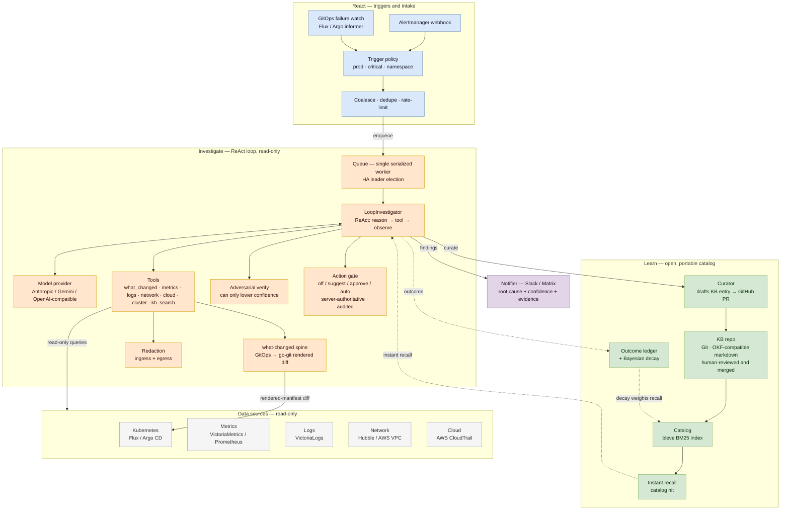

The detailed architecture as the **React → Investigate → Learn** flow, with the read-only
data-source fan-out and the learning-loop feedback. (The README's "How it works" diagram is the
one-glance summary; this is the source-of-truth detail.)

## Reading it

- **React** — an Alertmanager alert or a GitOps-failure event passes the trigger policy, is
  coalesced / deduped / rate-limited, and enqueued.
- **Investigate** — a **single serialized worker** (HA leader-elected) runs the ReAct loop: the model
  drives **read-only** tools; the **what-changed spine** diffs the exact GitOps revisions Flux/Argo
  reconciled; findings are adversarially verified, secrets are redacted in *and* out, and any proposed
  action passes the **server-authoritative** gate (with a hash-chained audit log).
- **Learn** — the curator opens a KB pull request; once a human merges it, the catalog re-indexes and
  feeds **instant recall** back into the loop, while the outcome ledger's decay weights future recall.

## Extensibility — adding a source or a notifier

Event **sources** and chat **notifiers** are pluggable through two symmetric registries. The core owns
the cross-cutting machinery; an adapter supplies only the semantic bit and self-registers — no edits to
`cmd/lore/main.go` wiring and no edits to the central `config.Config` struct.

- **A source** is a Go package under `internal/source/<name>/` that implements one of two interfaces and
  calls `source.Register` in its `init()`:
  - `WebhookSource` (push) — `Decode(body, header) → ([]Request, resolutions)`. The core provides the HTTP
    transport (auth, body-cap, routing) and mounts it at the descriptor's `Path`.
  - `WatcherSource` (pull) — `Watch(ctx) → <-chan Request`. The core runs it and applies dedup/debounce.
  Everything an adapter produces is the normalized `investigate.Request`; the shared **ingest pipeline**
  (trigger policy · dedup · coalesce · rate-limit) and the enqueue path are identical for every source.
  The adapter reads its own config from `Deps.Raw[<name>]` (the `sources.<name>:` block). Wire it with a
  single blank import in `main`.
- **A notifier** is a package under `internal/notify/<name>/` implementing `providers.Notifier.Deliver`,
  registered via `notify.Register`; built-ins (Slack, Matrix) read typed config, others read
  `notify.<name>` from the `Notify.Extra` map. `internal/notify/webhook` (a generic outgoing-webhook
  sink) is the reference example: it is one self-registering file plus one blank import — zero changes to
  central config.

> **Why typed adapters, not a generic CloudEvents envelope:** RunLore is a *terminal investigator*, not a
> node in an event mesh. The value at intake is extracting a good investigation seed (workload, symptom,
> change-anchor), which a generic envelope does not help with — so each source gets a small typed adapter.
> A CloudEvents ingress could later be *one such adapter* (for Argo Events / Knative shops), never the core.
