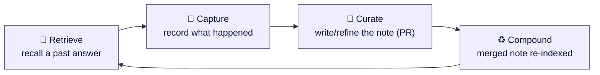
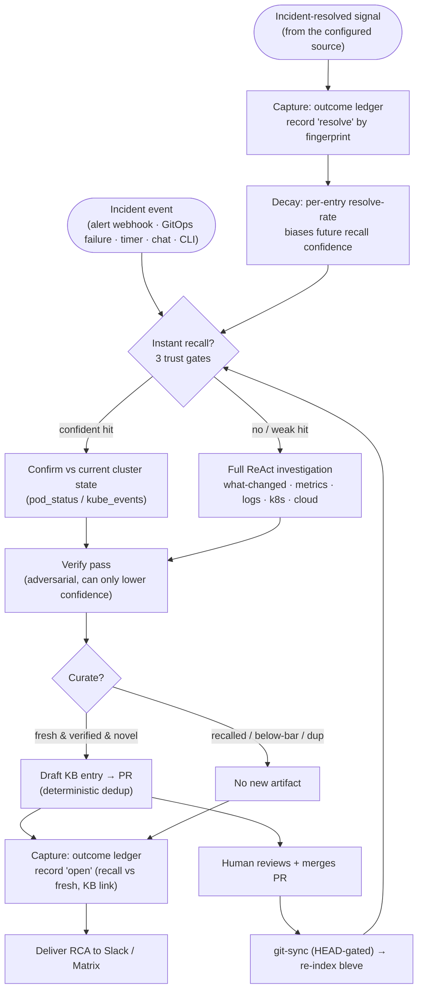
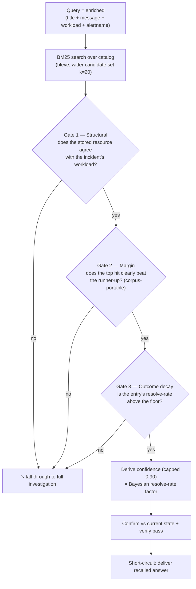
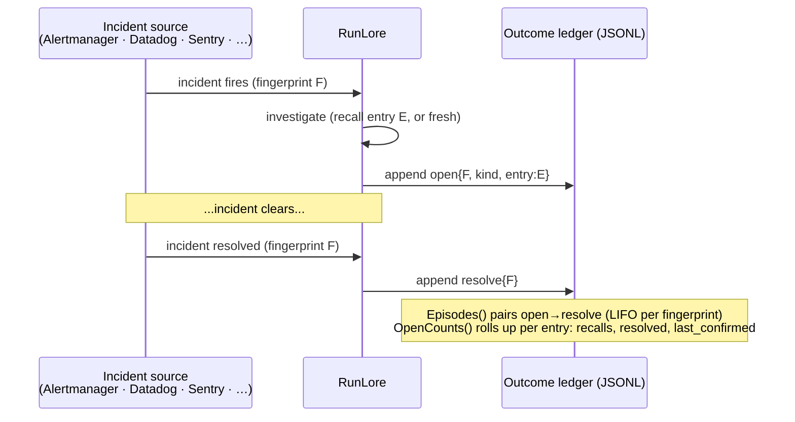
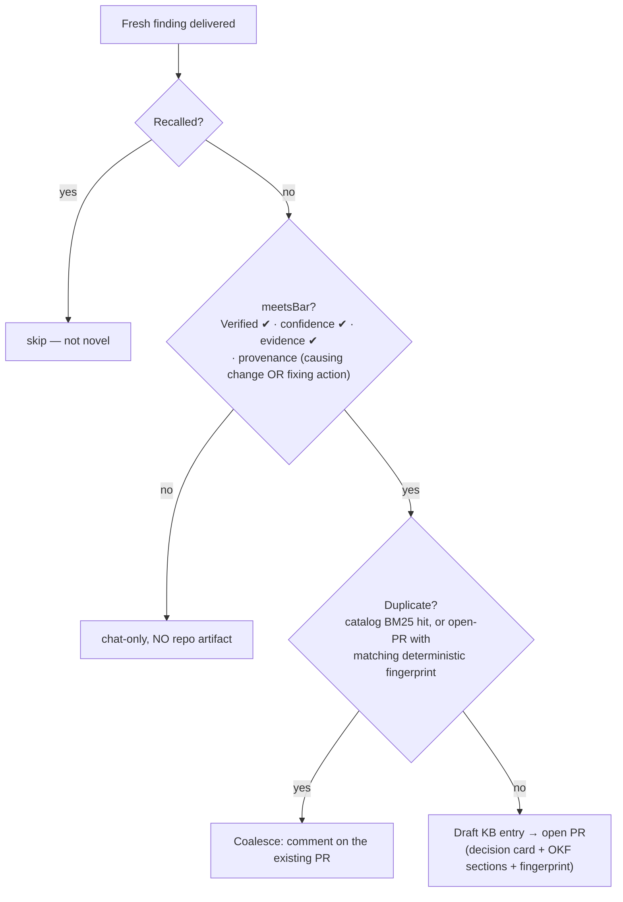
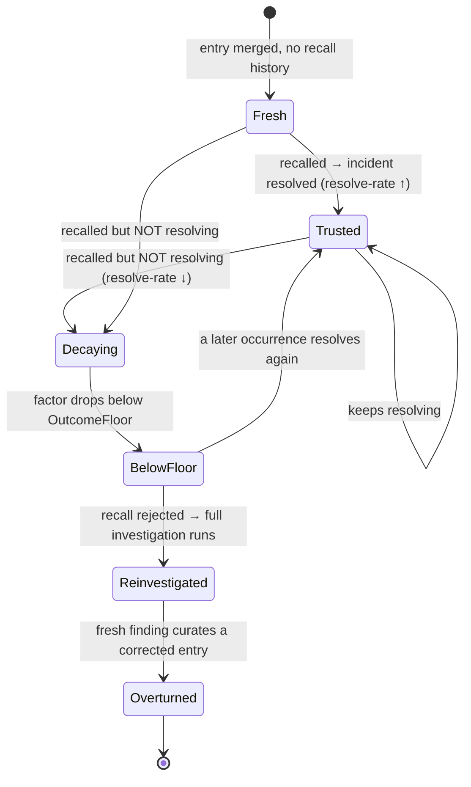

> Companion to [`design.md`](). This document explains the **learning
> loop** specifically: what "learning" means in RunLore, how each stage works, and
> *why* it was built the way it was.

> **TL;DR.** On an incident, RunLore first tries to **recall** a trustworthy past
> answer from a git-versioned catalog — instant, no investigation; otherwise it
> investigates. It then **captures** whether the incident actually resolved,
> **curates** a verified, novel finding into a **human-reviewed pull request**, and
> once a human merges it the entry **compounds** (recall-able next time). What makes
> this *learning* and not note-taking: a note's trust is **derived from its real-world
> resolve-rate** (plus 👍/👎 votes), so a note that stops working **decays** and can be
> overturned. And the human stays in the loop throughout — **RunLore drafts, a human
> merges; nothing is auto-written.** (Deep dives: §3 Retrieve, §4 Capture, §6 Decay,
> §8 Validation.)

> **Terminology.** On this page a **note** always means a *curated entry* — the
> symptom → cause → resolution record RunLore drafts and a human merges. An **operator
> note** is a different object: a message a human writes in a chat thread, which RunLore
> files to the KB. It is not evidence-bearing and it behaves differently on the recall
> path; see §10.

---

## 1. In plain words

A normal SRE agent answers the same incident from scratch every single time. RunLore
tries to **remember** instead.

When RunLore resolves an incident, it writes a short, structured note — *symptom →
cause → resolution* — into an **open, git-versioned knowledge catalog** (a folder of
markdown files in a Git repo, reviewed via pull request like any other code). The
next time a similar incident fires, RunLore **reads that note back** in milliseconds
instead of re-running a multi-minute investigation. And crucially, it **watches what
happens next**: if the remembered answer was followed by the incident actually
clearing, that note earns trust; if a note keeps getting recalled but the incident
never resolves, that note *loses* trust and eventually stops being used until a fresh
investigation overturns it.

So "learning" here is a loop of four moves:



- **Retrieve** — on a new incident, look for a trustworthy matching note and use it.
- **Capture** — record that this incident happened and whether it then resolved.
- **Curate** — turn a fresh, *verified* finding into a reviewable catalog entry (and
  collapse duplicates).
- **Compound** — once a human merges the PR, the note is re-indexed and becomes
  recall-able for everyone, so the catalog gets denser and the agent faster.

The two things that make this *learning* rather than mere note-taking:

1. **Outcomes feed back.** A recalled note's trust is derived from its real-world
   resolve-rate, not asserted by the model.
2. **Knowledge is communal and provenance-tracked.** Entries live in Git, are
   PR-reviewed, carry the change that caused the incident, and can be overturned.

---

## 2. The loop, end to end

> **The event source is pluggable.** RunLore reacts to an *incident* from whatever
> trigger is configured — an alert webhook (Alertmanager/VMAlert today; a Datadog,
> Sentry, PagerDuty, or other monitor tomorrow), a GitOps reconcile failure, a timer,
> chat, or the CLI. Nothing in the learning loop is bound to a specific source: an
> incident is normalized to a fingerprint + title + (optional) workload at the trigger
> edge, and every stage below — recall, the outcome ledger, curation — operates on
> that normalized shape, never on a source-specific API. Where this doc names
> Alertmanager, read it as "the configured incident source."



Everything below zooms into the four boxes that matter: **Retrieve**, **Capture**,
**Curate**, **Compound** — plus the **feedback edge** (decay) and how we **validate**
the whole thing.

---

## 3. Retrieve — instant recall, but only when it's trustworthy

**Where:** `internal/investigate/recall.go`, wired in `internal/investigate/loop.go`.

The agent never blindly trusts the catalog. A recall short-circuit (answer without
investigating) only fires when a hit clears **three independent gates**, and even
then the answer is confirmed against live state and re-reviewed.

> **First read?** Skip the next two blockquotes and go straight to the **three-gate
> diagram** below — that's the core of recall. The two boxes are opt-in *refinements*
> to how the gate scores a candidate (hybrid embeddings, and the LLM reranker that is
> on by default); come back to them when you want to tune it.

> **Hybrid recall (experimental, opt-in).** With `instant_recall.hybrid` set and a
> `model.embeddings` endpoint configured, the BM25 search below is fused with
> embedding-cosine similarity (Reciprocal Rank Fusion), and Gate 2's margin is measured
> on **cosine** (`hybrid_min_score` / `hybrid_margin_gap`) rather than the BM25 score.
> Default off — with no embedder the catalog stays BM25-only and recall is unchanged.
> The cosine thresholds are conservative placeholders; tune them against the
> instant-recall eval before relying on them.

> **LLM reranker (on by default) — the principled fire gate.** Unless
> `instant_recall.rerank` is explicitly set to `false`, Gate 2 (the BM25-magnitude
> margin) is **replaced** by a calibrated
> match-confidence gate. Query enrichment fixed retrieval *ranking* — on the real
> corpus the correct runbook now ranks #1 (Recall@1 = 1.00, MRR 1.00) — but the
> short-circuit still gated on the **absolute** BM25 magnitude (`solo_floor`), and an
> enriched real-corpus score is ~0.1–1.2, an *order of magnitude* below the default
> `solo_floor` 4.0. So recall only fired where an operator hand-tuned `solo_floor` down
> to their corpus's score regime — a fragile gate that does not "just work" at the
> default across clusters. The reranker takes the top-`rerank_k` structurally-agreeing
> candidates, asks the model in **one cheap call** ("which candidate, if any, is the
> correct runbook for THIS incident, and how confident are you?"), and fires only when
> the **calibrated** confidence clears `rerank_threshold` (default 0.7). Because a
> calibrated 0–1 confidence is **corpus-independent**, the same default fires across
> corpora — the BM25 score is demoted to retrieval-ranking-only (pick the top-K).
>
> Measured on the eval harness at default thresholds (`recalleval_test.go`,
> `TestRecallEvalRerankFireRate`) over **11 label-derived positives and 2 negatives**:
>
> | | fire-rate (label positives) | precision | negatives fired |
> |---|---|---|---|
> | rerank **off** | 0/11 (0.00) | — | 0/2 |
> | rerank **on** | **11/11 (1.00)** | **1.00** | **0/2** |
>
> **What this does and does not measure.** The rerank-**on** row uses a *scripted*
> reranker — a stand-in that returns the correct candidate at fixed confidence. So the
> row measures the **fire gate and the corpus's structural agreement**, not a model's
> reranking accuracy: it proves that when the reranker is right, the calibrated gate
> fires at the default threshold, which BM25-magnitude gating never did. It is **not a
> model benchmark**. For what a real model achieves on real incidents, the honest
> reference point is ITBench: frontier models identify the root cause **< 50%** of the
> time (see [Benchmarking]()). The
> corpus here is small and hand-built; treat these numbers as a regression guard on the
> gate, not as a field measurement.
>
> **Cost & false-recall discipline.** The reranker runs *before* the "free"
> short-circuit, so its call is paid on every incident that reaches it — the ones that
> then fall through to a full investigation included: one call over `rerank_k`
> candidates, skipped only when the top score is under `rerank_min_score` (default
> **0.1**, the bottom of the ~0.1–1.2 band real scores occupy, so it rarely skips). It
> routes to `model.verify` (cheaper/faster) when configured, costs ~1–2k tokens, and
> buys back a whole investigation when it fires — the recorded demo transcript's came to
> 7 calls / ~15.6k tokens, against a `max_tokens_per_investigation` default of 400k. A
> reranker that hallucinates a match is worse than no recall, so it fails **safe**: it
> only ranks candidates that already passed the structural filter, ignores any
> `entry_id` it did not offer, and
> treats a "no match", a low confidence, or a model error as a fall-through to a full
> investigation (the negative cases fire on **zero** entries). Everything downstream is
> unchanged — the recalled answer still goes through live-state **confirm** and the
> adversarial **verify** pass. The reranker is a *retrieval-time* decision ("which
> candidate + confident enough to short-circuit"), **not** a second verify.



Why each gate exists:

- **BM25, not TF-IDF.** The index is pinned to BM25 scoring
  (`internal/catalog/catalog.go`, `newIndexMapping`). BM25's saturating,
  length-normalized scores are far more corpus-portable, so the *relative margin* gate
  below is meaningful as the catalog grows. (Earlier the index silently ran legacy
  TF-IDF, invalidating every threshold — fixing that was the cheapest high-leverage
  change in the codebase.)
- **Gate 1 — structural agreement** (`resourceAgrees`). The incident names a workload
  (namespace + name, derived from the source's labels — e.g. Alertmanager
  `pod`/`deployment`); the entry stores the resource its incident affected. They must
  agree. This is the lever that separates "many
  symptoms → one cause": a `CrashLoopBackOff` in `apps/web` should not recall an OOM
  runbook for `apps/worker`. It's a **pre-filter** over a wide candidate set (k=20),
  not a check of only the top lexical hit, so the structurally-correct entry can win
  even when a wrong-workload entry scores higher on symptom words. Agreement is by
  **identity, not spelling**: a per-pod name reduces to its controller family
  (`tooling/harbor-registry-59598dbd57-ltkzw` → `tooling/harbor-registry`), and a
  **cloud** resource is matched through its ARN — a CloudWatch alert names one RDS
  instance by its `DBInstanceIdentifier` on one firing and by its full ARN on the
  next, and both reach the same entry.

  Be aware of the limit of that last one. Alerts are canonicalised to the bare
  identifier when they are ingested, so the incoming side carries no account or
  region and agrees with an ARN-form entry from **any** account; the account/region
  check only separates two values that both still carry them (two legacy ARN-form
  entries). The same collapse keys the recurrence ledger, so if you run one instance
  name in two AWS accounts and alert on both through a single Prometheus, treat them
  as one identity for recall and recurrence — or give the two alerts different
  `alertname`s. A **workload-less**
  incident (PagerDuty carries no Kubernetes namespace/name) agrees only with entries
  that are themselves resource-less — the weakest ("scopeless") tier: it always
  requires `solo_floor` + `min_score`, starts at reduced confidence, and
  `require_workload_match: true` disables it.
- **Gate 2 — relative margin.** The top agreeing hit must beat the runner-up by a
  configured gap (or clear a solo floor when there's only one). Because BM25 scores
  are corpus-dependent, RunLore trusts the *gap between candidates*, not an absolute
  score.
- **Gate 3 — outcome decay** (see §6). The entry's historical resolve-rate must be
  above a floor; a note that recalls but never resolves is rejected and forces a
  fresh investigation.

Then two safety backstops before the recalled answer is delivered:

- **Confirm against current state** (`internal/investigate/confirm.go`). Before
  trusting a remembered answer, RunLore makes 1–2 cheap, read-only cluster calls
  (`pod_status`, `kube_events`) scoped to the workload's **namespace** — deliberately
  namespace-wide, *not* just the alerting object — so a cause living on a
  **neighbouring resource** (a dependency, an upstream, a Crossplane claim, not the
  pod that alerted) is still confirmed, and appends that *current state* to the
  finding. This is non-LLM and fast. If it can't gather state (no namespace / tools
  absent), the recalled confidence is capped lower (0.70) so an unconfirmable memory
  isn't presented at full confidence.
- **Verify pass** (`internal/investigate/verify.go`). An adversarial reviewer judges
  the finding **only on the evidence given** and can *only lower* confidence. Because
  the confirm step injected real cluster state, verify can now actually catch a stale
  or wrong note (previously it only saw a tautological "matched entry X" string and
  was a no-op on the recall path). **On a model outage it fails closed here**: verify
  is the recalled answer's *only* adversarial check (unlike a full investigation,
  there is no independently-gathered tool evidence backing it), so a verify pass that
  could not run — a model error, or a response with no usable verdict — is treated as
  a fire-gate **miss**, not an approval, and forces the same fall-through to a full
  investigation an outright rejection takes. This is a deliberately different policy
  from the full-investigation call site, where verify only augments findings already
  built from real tool evidence, so a down reviewer there leaves them as-is instead of
  discarding real evidence.

  Failing closed here is the correct trade, but it is not free, and both costs land
  precisely when things are already going wrong: **cost/load amplification** — a
  recall that would have cost two model calls (the reranker, which is on by default,
  then verify) now costs those two *plus* a full ReAct loop, up to `MaxSteps`
  (default 20) model calls plus tool calls and its own closing verify — the first two
  already spent when the fall-through starts, and all of it arriving exactly when the
  verify endpoint is unhealthy; and a
  **slow-verify timeout interaction** — the investigation's overall `Timeout` bounds
  the whole run *including* the failed verify call, so if verify fails by exhausting
  that deadline rather than erroring fast, the fall-through inherits an already-spent
  budget and the user gets a synthetic timeout result where they previously got the
  recalled answer. Worth knowing before an on-call incident, not discovering during
  one.

**Confidence is derived, never asserted** (`deriveRecallConfidence`,
`outcomeFactor`): it's a function of the BM25 score, the margin, the structural-match
strength, and the Bayesian-smoothed resolve-rate — and it is **capped at 0.90**. The
agent is structurally unable to claim certainty from memory alone.

**A recall is made visible in the notification** (`internal/notify/`). A short-circuit
would otherwise read as a low-confidence fresh investigation, so a recalled answer leads
with an explicit **⚡ Instant recall** block: "answered from your knowledge base, no
investigation was run", the entry's known cause + human-reviewed resolution, a link to the
catalog entry, and its **resolve-rate track record** (the outcome-ledger signal that makes
the cached answer trustworthy). This is the on-call-facing face of the Compound step (§7).

> **Safety note:** instant recall is *disabled* under autonomy mode `auto`
> (`loop.go`) — a poisoned catalog entry must never short-circuit straight into an
> auto-executed remediation. Recall accelerates *humans*, not unattended actions.

---

## 4. Capture — the outcome ledger (the "did it actually work?" record)

**Where:** `internal/outcome/ledger.go`.

This is the part almost no other open-source SRE agent has: a durable, append-only
record of **whether a recalled answer preceded the incident actually resolving**.

- When an investigation completes, RunLore appends an **`open`** event: the incident's
  fingerprint, whether it was answered by `recall` or a `fresh` investigation, and —
  for recalls — *which catalog entry* was used.
- When the matching **incident-resolved signal** arrives (a resolved-alert webhook
  today; any source's "cleared" event by design), RunLore appends a **`resolve`** event
  for that fingerprint.

The `open` event also now records the incident's **trigger key**, the **curated KB link**
(so a recurrence can surface "previous: <link>"), and the curator's machine **verdict** —
curation runs *before* the ledger open so the KB URL is present on the open itself.



Two read APIs turn this raw log into a learning signal:

- **`Episodes()`** replays the whole ledger and pairs each `resolve` with the most
  recent unresolved `open` for the same fingerprint — so **recurrence is preserved**
  (3 opens + 1 resolve ⇒ 3 episodes, 1 resolved). It is order-independent: a resolve
  that lands *before* its open (a transient incident that cleared mid-investigation)
  is buffered and paired with the next open.
- **`OpenCounts()`** rolls episodes up **per catalog entry**: how many times the entry
  was recalled, how many of those resolved, and when it last resolved.
- **`Occurrences()`** rolls opens up **per trigger key** (a `byTrigger` index folded on
  each open): how many times *this alert* has fired, when the last occurrence was, and the
  KB link from the previous one. The delivery path reads this to stamp **recurrence facts**
  (occurrence count + previous-KB link) onto the notification, so a repeat alert is
  visibly flagged as recurring rather than looking brand-new. When the recurring
  incident's merged entry is findable by dup-fingerprint, the notification also quotes
  the entry's **cause and human-reviewed resolution** inline (with its recall
  resolve-rate), so the previous answer is readable without leaving chat.
- **`Feedback()`** appends a human **`feedback`** event — the 👍/👎 buttons on Slack
  investigation messages (opt-in, `notify.slack.feedback_buttons`) or 👍/👎 **reactions**
  on Matrix ones (opt-in, `notify.matrix.feedback_reactions`, zero-ingress; see
  [configuration.md]()). A vote is attributed
  to the catalog entry behind the trigger key's **newest open** (via the same
  `byTrigger` index; a fresh investigation has no entry, so its votes are recorded but
  weigh nothing), deduplicated to **one live vote per (trigger key, user)** —
  a duplicate click is idempotent, changing your mind *moves* the vote — and folded
  into `OpenCounts()` as per-entry `FeedbackUp` / `FeedbackDown`.

Design choices worth calling out:

- **Append-only JSONL, replayed.** The in-memory open-index is lossy by design (it
  forgets resolved opens); the file is the durable truth. Attribution is robust to
  restarts and to per-fingerprint coalescing (each constituent alert in a coalesced
  storm records its own open so each resolve matches).
- **Durability is opt-in but real.** The ledger (and the hash-chained audit log) can
  be backed by a `ReadWriteMany` PVC so they survive pod restart *and* leader failover
  — otherwise they live on an `emptyDir` and are explicitly ephemeral.

---

## 5. Curate — turning a verified finding into reviewable, deduplicated knowledge

**Where:** `internal/curator/` (file-time) and `internal/curate/` (scheduled Phase-2).

Not every finding deserves to enter the shared catalog. Curation is a gate, not a
firehose.



When there is anything to show, the drafted PR body also carries a *Related knowledge* section — the dedup search's k=5 neighborhood plus the trigger's recurrence line — so the human reviewing the entry sees what the catalog already holds.

The two load-bearing ideas:

- **Quality gate first (`meetsBar`).** A finding reaches the catalog only if it was
  **`Verified`** (it survived the adversarial verify pass with a cause intact),
  *and* it's confident, *and* it cites evidence, *and* it carries **provenance** — a
  causing-change reference (`ChangeRef`) **or** a fixing action (`SuggestedAction`).
  The provenance check is an **OR**, deliberately: requiring a GitOps change for every
  entry would wrongly exclude legitimate non-deploy incidents (saturation, cert
  expiry), and requiring a known fix would exclude honest "we don't know the fix yet"
  entries. A finding with *neither* anchor is a bare symptom restatement and is kept
  out. The gate runs **before** dedup, so a below-bar/unverified finding produces
  **zero** repo artifacts — not even a coalesce comment.
- **Deterministic dedup, not prose matching.** The open-PR dedup keys on a
  `DupFingerprint`, stored both in the entry's YAML frontmatter and as a hidden marker
  in the PR body. Two investigations of *one* incident produce different LLM prose but
  the **same** fingerprint, so the second coalesces onto the first instead of opening a
  duplicate PR. The fingerprint has two branches, deliberately anchored on the most
  stable identity available:
  - **Trigger-keyed (primary).** When the incident carries a `TriggerKey` — an
    alert fingerprint, or a GitOps `resource + condition reason`, i.e. any
    structured, source-emitted signal — the key is
    `sha256(resource-ref + "|trigger:" + triggerKey)`. Re-investigations of one
    ongoing incident reword the LLM's prose cause but share the same trigger, so
    keying on the *trigger identity* (stabler than model prose) is what coalesces
    them. The `"trigger:"` namespace ensures a trigger value can never collide with a
    prose cause from the fallback.
  - **Cause-keyed (fallback).** When there is no trigger key — a triggerless, manual
    `lore investigate --alert "<symptom>"` — it falls back to
    `sha256(resource-ref + "|" + normalized cause token-set)`, the order-independent
    significant-token set of the top root cause. This itself falls back to the raw
    lowercased summary when tokenization would erase a terse/acronym cause (e.g.
    "IO GC"), so two different terse causes on one resource can't collide.

**Phase-2 grooming** (`internal/curate/`) keeps the backlog healthy on a schedule. It
runs **inside the serve pod** (leader-only, every `curate.sweeps.interval`, default 6 h)
whenever the KB forge is configured — **in dry-run by default**: candidates are logged and
recorded in the action audit chain (`actions.audit_log_path`), and nothing touches the
forge until you set `curate.sweeps.mode: apply`. The opt-in `lore curate` CronJob remains
the out-of-server alternative (same passes, shared wiring — `--dry-run` there too).

- **Dedup** — collapse near-identical *open* PRs across history (fingerprint match
  first — when both PRs carry a `DupFingerprint` marker they're duplicates iff the
  fingerprints are equal — with Jaccard title-similarity as the fallback for
  markerless legacy PRs), closing the higher-numbered duplicate with a back-reference.
- **Lifecycle** — close stale, unprotected PRs (no forge activity within
  `stale_after`), never touching human-labelled ones, and only after a back-ref
  comment. `stale_after: 0` disables the sweep.
- **Suppress** — close a PR that *re-drafts* an entry a human already rejected (closed
  without merging). The drafter's dedup only checks open PRs and merged entries, so a
  recurring permanently-benign incident would re-open a fresh PR forever. The close
  carries a back-reference to the original human decision (and its `wontfix` /
  `not-kb-worthy` label when present); a `needs-work` close is a revise-and-resubmit and
  is never suppressed. Reconsideration stays with Recurrence's knowledge-gap escalation —
  suppression never argues with a human, it just stops re-asking.

Three further passes are also wired, all **ledger-backed** (they read the outcome
ledger, so they stay source-neutral):

- **Queue** — promote a human-`solved` PR to *ready-to-merge* once its incident has
  resolved. The PR↔incident join is **fingerprint-first**: the PR's `DupFingerprint`
  marker is matched against the resolved episodes' dup-fingerprints (the same value
  the ledger stamps on each open), so a resolved episode flips the PR onto the
  merge-ready queue regardless of the LLM's re-worded title. Exact title match
  (`"KB: " + the incident title`) is only a legacy fallback for markerless,
  hand-filed PRs. A human still merges.
- **Recurrence** — open one *knowledge-gap* issue when an unresolved pattern (the
  affected resource) recurs past `recurrence_threshold`. Idempotent by an existing-issue
  check (the forge's open gap issues are the "already-opened" record), so re-running
  never double-opens — no mutable store.
  - **Closed-unmerged escalation.** When a human closes a drafted KB PR *without
    merging*, that is a deliberate "not KB-worthy". RunLore does **not** reopen it (a
    reopen re-litigates a human "no" and resurrects exactly the entries humans reject).
    Instead the entry's `DupFingerprint` is treated as **suppressed** — derived each run
    from the forge's closed-unmerged `runlore` PRs, so there is still no mutable store —
    and its recurrences are counted *silently* on the fingerprint. Once they cross
    `recurrence_threshold`, Recurrence escalates via a knowledge-gap issue that **links
    the closed PR** and cites the count ("closed unmerged but has recurred N times —
    reconsider?"), respecting the close instead of overriding it. A close labelled
    `needs-work` is a revise-and-resubmit (not a rejection) and is left to the generic
    recurrence path; `wontfix` / `not-kb-worthy` are captured as the escalation's close
    reason. A *merged* PR is an accepted entry and is never suppressed.
- **Contested** — when humans hold standing 👎 votes on the investigation behind a
  *pending* KB entry (a 👎 on a fresh investigation weighs nothing in recall trust —
  there is no catalog entry yet), the pass posts one warning comment on the still-open
  KB PR so the reviewer sees the contest before merging; idempotent via a hidden
  per-trigger marker in the comment, no mutable store.

Finally, two **opt-in** passes act on an entry's own track record rather than on the
PR backlog — the *garbage-collection* half of the loop, where decay existed but had no
consequence beyond recall rejection, and its mirror image:

- **Retirement** (`curate.retirement.enabled`, default **off**) — opens a
  human-reviewed *retire* PR for a **merged** catalog entry whose outcome factor stayed
  below the trust floor across a **sustained** run of observations
  (`min_observations`, default 3 — so a single bad recall, factor 0.33, can never retire
  an entry). It uses the **same decay formula and floor as recall's Gate 3**
  (`outcome.Aggregate.Factor`, the one definition both gates share), so the entry
  proposed for retirement is exactly the one recall already rejects — every recurrence
  was already paying a full investigation. The PR stamps `status: retired` into the
  entry's YAML frontmatter (a surgical one-line edit that preserves the human's
  formatting) and a human merges: retirement **never** merges or deletes, so a retired
  entry stays in git history — it just stops being recallable. Idempotent and
  **human-veto-aware** via a hidden per-entry marker in the PR body: an open retire PR
  is never re-proposed, and a retire PR a human **closed without merging** is a
  deliberate "keep it" that is never re-nagged (the same closed-unmerged-is-a-no
  philosophy as the recurrence escalation above). Per-item error isolation: one flaky
  entry never starves the rest of a run.
  - **Seam (now live).** Recall honours the `status: retired` frontmatter this pass
    writes: a retired (or `draft`) entry is filtered at recall's structural pre-filter,
    so it never fires and is never offered as a near-miss lead — while `kb_search`/`kb_get`
    keep surfacing it (status-visible) for KB archaeology. A merged retirement PR is
    therefore effective end-to-end. Fail-safe: an absent or unknown status is treated as
    active (OKF §9 tolerance), so pre-retirement catalogs behave exactly as before.
- **Revalidation** (`curate.revalidation.enabled`, default **off**) — the mirror
  image: it opens a human-reviewed *revalidate* PR for a **merged** entry that was
  recalled for a live incident which then **resolved**, proposing to stamp
  `last_validated` with that resolve date. This is the seam that lets the field be
  *earned*: before it, freshness could only decay (§6). One resolved recall is the
  whole evidence bar — deliberately, because it is a far denser chain of checks than
  retirement's evidence: the entry won recall's gates, was confirmed against **live
  cluster state**, survived the adversarial **verify** pass, was delivered as the
  answer, and the incident then cleared. Retirement needs `min_observations` to tell
  a bad recall from noise; a confirmation does not. The PR makes a **one-line
  frontmatter edit** and nothing else — no status change, no content change — and,
  as with retirement, a human merges: `last_validated` claims *human* confirmation,
  and merging **is** that act, so RunLore can bring the evidence but must never
  write the field itself. Anti-spam is two-layered: a candidate date must be at
  least `min_interval` (default **720h**) newer than what the entry already records,
  checked against the file on the base branch so a merged stamp silences the next
  sweep with no state to keep; and `max_open` (default **5**) bounds how many
  revalidation PRs may await review at once, counting ones earlier sweeps left open
  — so enabling the pass on a mature catalog drains a queue instead of flooding one.
  Idempotent and **human-veto-aware** through the same hidden per-entry marker, and
  the marker is keyed on the entry *path*, never the date, precisely so a decline
  stays declined rather than returning monthly. That veto is also why **no other
  pass may close a retire or revalidate PR**: these passes keep no store, so a
  closed-unmerged proposal *is* the record of a human declining, and RunLore closing
  its own proposal — as a stale artifact, or as a title-similar "duplicate" — would
  be indistinguishable from that. Both the stale sweep and dedup skip them; the
  queue bound above is what keeps an unreviewed backlog finite instead.
  - **Retirement wins where they meet.** Both passes read the same aggregate and
    the same `outcome.Aggregate.Factor`, and within one sweep they are **disjoint by
    construction**: retirement fires strictly *below* the trust floor, revalidation
    only *at or above* it. So one sweep can never propose retiring and revalidating
    the same entry, and an entry recall already refuses to fire is never stamped
    "still valid", whatever a stale resolve in its history says.

    That construction is arithmetic, not a rule either pass applies, so it holds
    only while both read the **same** floor and prior. `curate.revalidation.floor`
    and `curate.revalidation.prior` therefore *inherit* `curate.retirement`'s when
    left unset, and setting them to different values while both passes are enabled
    is rejected at config load — unequal floors would otherwise leave a band where
    both passes fire on one entry.

    **Across sweeps the guarantee is weaker, by design.** An entry whose factor
    recovers after a retire PR was already opened can pick up a revalidate PR while
    that retire PR is still open. Nothing suppresses it, because both proposals are
    then honest: the track record really did decay, and it really has recovered. A
    reviewer holding both decides which one the entry deserves — merging the retire
    PR makes the revalidation moot, since a retired entry is refused outright.

---

## 6. The feedback edge — outcome-driven decay (what makes it *learn*)

This is the make-or-break: the edge from **Capture** back into **Retrieve**.

`OpenCounts()` gives, per entry, `recalls`, `resolved`, and the human feedback votes
(`FeedbackUp` / `FeedbackDown`). RunLore turns that into a **Bayesian-smoothed success
rate** and multiplies the derived recall confidence by it (`outcomeFactor`, applied in
`recall.go`):

```
            resolved + up + 1
factor  =  -----------------------      (a Beta(1,1) prior — k≈2 — so a brand-new
            recalls + up + down + 2      entry isn't punished for having no history)

confidence  =  clamp( base_confidence × factor , 0 , 0.90 )
```

Human 👍/👎 votes are **extra Bernoulli observations in the same posterior** — a 👍 is
one success, a 👎 one failure, each weighing exactly like a resolved/unresolved recall.
That matters most where the resolve signal *cannot exist*.

**What is excluded from resolve-based decay is decided by the fingerprint, and by
nothing else.** RunLore mints a synthetic id for an incident that carries no external
alert fingerprint, and exactly those two shapes are excluded: **GitOps failures**
(`gitops:…`) and **re-investigate polls** (`reinvestigate:…`). Such a recall is still
recorded for recurrence, but it never enters the `OpenCounts` roll-up — so Gate 3 never
computes a factor for it at all and falls through to its fail-safe (*absence of evidence
must never block a recall*), which is **1.0**: full trust, **not** the 0.5 prior mean.
An entry recalled only from those sources therefore keeps firing at full confidence
however wrong it has become, and retirement never surfaces it either, because an entry
the roll-up has never seen is not a candidate. A human's explicit 👎 (a Slack click or a
Matrix reaction) is the only ground truth those paths can ever accumulate — and it is a
judgment on the *diagnosis itself*, which an alert merely clearing never proves.

**An Alertmanager alert is never in that excluded set** — not even when its receiver has
`send_resolved` off. Resolvability is read off the fingerprint alone
(`resolvable := !outcome.Derived(fp)`), never off the receiver config, which RunLore
cannot see. A real alert fingerprint is therefore always recorded resolvable, and every
recall increments `recalls` while `resolved` stays 0. The factor drops at once: **one**
unresolved recall already lands the entry at **0.333**, below the shipped
`outcome_floor` of **0.5**.

That arithmetic is correct only where a resolve could actually have arrived, so **Gate 3
withholds decay until the ledger has observed at least one resolve, from any
fingerprint** (`Ledger.ResolveChannelLive`). An entry with no outcome of any kind — no
resolve, no vote, no confirmation — on a deployment that has never delivered a single
resolve is not a failing entry; it is one nobody can grade, and decaying it treats *we
never asked* as *the answer was wrong*. That is not hypothetical: measured on a shared
cluster in 2026-08 with `send_resolved: false`, exactly one recall had ever fired and
the same alert was then re-investigated from scratch three times in twelve hours.

The withholding is scoped as tightly as possible. The moment the entry earns any ground
truth, **or** the ledger sees any resolve at all, the full posterior applies —
including every unresolved recall banked up to that point — so a genuinely stale entry
on a working resolve channel still decays exactly as described above. A human 👎 bites
either way, which is what makes it, per the paragraph above, the one signal a
resolve-less deployment can always accumulate.

Two consequences worth stating plainly. Turning `send_resolved` **on** is what makes
resolve-based decay work at all, and it costs nothing: a resolved alert decodes to a
resolution, never to an investigation. Leaving it **off** does not merely disable
learning — it also silently voids `triggers.incidents.debounce`, which holds a firing
alert and investigates only if no resolve arrived in the window.



The effect: a note that consistently precedes resolution stays trusted; a **stale or
poisoned** note that recalls-but-never-resolves decays below the floor, gets rejected
at Gate 3, triggers a fresh investigation, and can be **overturned** by a corrected
entry. Decay is **outcome/contradiction-driven, never pure mtime** — knowledge ages
out because it stops working, not merely because it's old.

**Two orthogonal freshness signals sit alongside this outcome decay**, both applied at
recall's structural pre-filter and both fail-safe (absent frontmatter reproduces the
pre-field behaviour byte-for-byte):

- **Status** — a `retired` or `draft` entry is dropped *before* the gate: it never
  fires and is never offered as a near-miss lead, which is what makes the retirement
  pass (§5) effective end-to-end. Any absent or unknown status is treated as active
  (OKF §9 tolerance). The entry stays indexed, so `kb_search`/`kb_get` still surface it
  — status-visible — for KB archaeology; recall is where the firing ban lives.
- **Age** (`catalog.instant_recall.stale_after`, opt-in; `0` disables) — an entry whose
  `last_validated` (else `timestamp`) predates the horizon has its delivered confidence
  taken **one** multiplicative step down (0.75). This is deliberately *not* a rejection
  and *not* a curve zoo: **age never rejects on its own** — the **confirm** step (Gate 1)
  and the adversarial **verify** pass remain the hard gates against a genuinely drifted
  answer, and the outcome floor (Gate 3) keeps priority (track record beats calendar).
  Staleness only stops a five-year-old runbook looking as confident as yesterday's. A
  dateless or unparseable-date entry is exempt.

  **`last_validated` is unset when RunLore drafts an entry** — the field claims a
  *human* confirmed the entry works, and a fresh draft has none, so the drafter has
  no honest value to write (`renderEntry`, `internal/forge/github`). Freshness
  therefore falls back to `timestamp` until the field is **earned**, which is what
  the opt-in **revalidation pass** (§5) is for: when a recall of the entry is
  followed by the incident actually resolving, it opens a PR proposing that resolve
  date, and **a human merging that PR is the confirmation the field claims**. Until
  then an entry can only get older; with the pass enabled, a note that keeps working
  keeps its freshness.

A `low_outcome` rejection does not abandon recall outright: the gate walks a small,
bounded set of further structurally-agreeing candidates (the runner-up fallback) —
each held to the conservative solo bar (or, with the reranker, chosen by one final
re-rank call over the remaining candidates) and to the same outcome gate. Only when
every candidate is decayed does recall fall through to a full investigation, and the
rejected entries are also excluded from the near-miss lead, so a decayed entry can
neither answer nor steer the fresh investigation that replaces it.

This is the answer to the hardest objection against KB-backed agents ("what happens
when a confidently-worded wrong belief gets in?"): the loop has a mechanism to lose
trust in it and overturn it.

The same per-trigger index also powers the **recurrence cooldown**
(`investigation.recurrence_cooldown`, opt-in): a trigger the agent conclusively
answered moments ago is not re-investigated — no model call, no duplicate
notification — until the cooldown lapses. The index tracks two separate facts about
a trigger, because they answer different questions: **when did we last look** (the
newest investigation, whatever it concluded — the cooldown lapses from there) and
**does an answer stand** (the newest investigation that actually *concluded*, which
need not be the newest one). Keeping them apart is what stops one run that mislabels
a known recurrence as `inconclusive` from erasing the answer behind it and re-arming
the full cost of every later firing. The escape hatches are human-deferential by
design: a trigger that has **never** concluded is re-investigated on every firing
(there is no answer to stand on), and a standing 👎 on the trigger re-arms
investigation immediately. So feedback does two jobs: it weighs *recalled knowledge*
(the decay above) and it governs *when the agent may repeat itself* — both steered
by the same single human 👍/👎 signal.

**Past the cooldown, the agent is told what it already concluded.** A recurrence
that outlives its cooldown gets a deliberate fresh look — but not a blind one: the
seed opens with the standing answer for that trigger (what was concluded, how
actionable it was, and how long ago), quoted as data and never as an instruction.
This exists because the agent otherwise has no way to report "this is the same known
fault": the verdict enum has no value for it, so it reaches for `inconclusive`, which
means the opposite and throws away a diagnosis it already had. The block says what to
do instead — confirm against live state, then restate the cause with the actionability
verdict it deserves, or name the new cause and put the old one in `ruled_out`. It is
wired to the trigger index directly, not to the opt-in cooldown, so it works whether
or not suppression is enabled.

**👎 recovery.** A standing 👎 forces re-investigation — and when that fresh
investigation independently reaches the same conclusion (identical dedup
fingerprint), the curator records a *confirmation* in the outcome ledger instead of
silently deduping it away. Confirmations are recovery evidence at **half** the
weight of a human observation: one 👎 needs two independent confirmations before
the entry's outcome factor climbs back to the floor and recall fires again (a
recall costs two model calls instead of a full investigation — this is what ends
the re-investigation loop). The human override itself is untouched: the recurrence
cooldown stays broken while the 👎 stands, and only the voter changing their vote
clears it. The open KB PR's contested warning shows the confirmation count so the
reviewer sees both signals.

The re-arm holds across the outer noise-control layers too — with one boundary.
The **coalescer's cooldown** (`investigation.coalesce.cooldown`, 10m default when
enabled) consults the same standing-👎 signal and lets a contested trigger through
instead of absorbing it as storm noise, so the layers cannot silently defer the
re-arm. A contested re-fire takes the coalescer's normal batching path (flushed
after `debounce`, not one flush per alert), so a contested *storm* still collapses
to a single re-investigation. **Fingerprint dedup** (`triggers.incidents.dedup.window`) is the exception:
it keys on the Alertmanager fingerprint before feedback is ever consulted, so a
*still-firing* alert re-sent with the same fingerprint inside the dedup window is
dropped regardless of a standing 👎. Precisely: a 👎 re-arms investigation at the
next occurrence that clears fingerprint dedup — a re-fire with a fresh fingerprint
(changed label set) immediately, a same-fingerprint repeat once the dedup window
(code default **0** = off; chart ships **30m**) has lapsed.

---

## 7. Compound — merged knowledge becomes everyone's, fast

**Where:** `internal/catalog/sync.go` + the readiness gate in `cmd/lore/main.go` /
`internal/server/server.go`.

A merged PR only helps if the running agent actually re-indexes it. RunLore keeps a
local Git mirror of the catalog and re-indexes on change:

- **HEAD-gated re-index.** The syncer tracks the last-synced commit hash and only
  rebuilds the in-memory BM25 index when the remote HEAD **actually moved** — not on
  every poll. A curator-merged PR moves HEAD → the next poll rebuilds exactly once.
  This runs on **every replica** (so a failover standby is already warm) and the
  per-poll rebuild cost is gone.
- **Readiness reflects warmth.** A replica doesn't advertise `/readyz` healthy until
  its catalog has loaded at least once, so it isn't routed incident traffic before its
  knowledge base is warm (a ConfigMap-mounted static catalog is ready immediately; a
  git-sync catalog becomes ready after its first index). Readiness is warmth only —
  leadership is handled by request forwarding, not by keeping standbys NotReady.

The compounding rate is ultimately bounded by **how fast humans merge PRs** — which is
deliberate. The catalog is a reviewed commons, not an auto-writing cache; the
propose-and-approve boundary is the safety property, and Phase-2 grooming exists to
keep that human queue tractable.

---

## 8. Validation — how we know any of this works

**Where:** `internal/eval/`, plus the nightly `.github/workflows/eval.yaml`.

Claims about a learning loop are worthless without measurement, so RunLore ships an
eval harness and treats its outputs as the source of truth:

- **Deterministic entity-precision scoring (Track A).** Beyond a fuzzy LLM-judge
  score, the harness checks whether the named root-cause *entities* are present and
  penalizes **over-claiming** (blaming plausible-but-wrong distractors) — the dominant
  failure mode strong models exhibit.
- **Statistical gating.** Reported runs use N≥10 with a **k-of-n** pass rule and a
  variance/flaky guard, so a verdict is a measurement, not a coin flip.
- **The closed loop is exercised in eval.** A poisoned-entry scenario proves a crafted
  wrong recall is *caught* by the verify pass — the poisoned answer is withdrawn and the
  agent **falls through to a real investigation** rather than publishing it — not just
  that the agent organically searched the KB.
- **The verify-unavailable case is pinned by a regression test, not eval.** A live-model
  replay can't reliably force a verify *outage* on demand, so the model-down variant
  (§3, "On a model outage it fails closed") is guarded outside the eval suite: a Go
  regression test replays the same shipped poisoned-entry fixture against a model that
  always errors and asserts the same withdrawal holds — recall is never delivered
  unreviewed just because the reviewer couldn't run.
- **CI.** A nightly (+ manual) workflow runs the replay eval with a fail-under gate
  and uploads the report; it's intentionally *not* a per-PR blocker (it drives a live
  model and can't run on fork PRs), while the deterministic scoring logic is unit-
  tested on every PR.

---

## 9. Design choices & rationale (at a glance)

| Choice | Why |
|---|---|
| **Derived, capped (≤0.90) recall confidence** | The agent must be unable to assert certainty from memory; trust is computed from score + margin + structural match + resolve-rate, never claimed. |
| **Relative margin gate (not an absolute score floor)** | BM25 scores are corpus-dependent; the *gap between candidates* stays meaningful as the catalog grows. |
| **Structural agreement as a pre-filter over wide-k** | Separates many-symptoms→one-cause; the right entry can win even when wrong-workload entries score higher on symptom words. |
| **Confirm vs current state before trusting a recall** | Lets the verify pass judge a remembered answer against reality, so a stale note is caught instead of rubber-stamped. |
| **Verify can only *lower* confidence** | A safety review must never manufacture confidence; worst case it's a no-op, never a promoter. |
| **Outcome-driven decay (never pure mtime)** | Knowledge ages out because it stops working, giving a concrete mechanism to overturn a confidently-wrong belief. |
| **Append-only JSONL ledger, replayed** | Robust, restart-safe attribution; preserves recurrence and tolerates out-of-order resolves. |
| **Deterministic dedup fingerprint** | Prose titles vary per run; a hash keyed on the incident's trigger identity (`resource+trigger`, primary) — or `resource+cause` for triggerless manual runs — makes "same incident" detectable and stops duplicate-PR floods. |
| **`meetsBar` before dedup; Verified + provenance required** | The shared, communal catalog only accepts adversarially-reviewed, actionable knowledge — and a below-bar finding produces *zero* repo artifacts. |
| **Provenance is OR (causing change ∨ fixing action)** | Avoids wrongly excluding non-GitOps incidents while still rejecting bare symptom restatements. |
| **Recall disabled under `auto`** | A poisoned entry must never short-circuit into an unattended remediation. |
| **PR-reviewed, git-versioned catalog** | The propose-and-approve human boundary *is* the safety model; provenance + reviewability are the durable, communal moat. |
| **HEAD-gated re-index + readiness-on-warmth** | Compounds merged knowledge promptly without wasteful per-poll rebuilds, and keeps a cold leader out of rotation. |
| **Eval: entity precision + k-of-n + poisoned-entry + CI** | Every learning claim is measured deterministically and statistically, and the closed loop is exercised, not assumed. |

---

## 10. Where it's deliberately incomplete

Honesty is part of the design:

- **Reversible `rollback` remediation** was scoped and **deliberately declined**: an
  in-cluster re-pin of a Flux Kustomization must patch a shared GitRepository in the
  protected `flux-system` namespace and diverges the cluster from Git. Remediation
  stays read-only / propose-and-approve; `auto` executes only suspend/resume/reconcile,
  and the agent *suggests* (never auto-applies) a rollback. The GitOps-correct form, if
  ever revisited, is a Git-revert PR. (See `design.md`, "Act".)
- The **Queue/Recurrence precision tradeoff**: the resolution join is now
  fingerprint-first (the PR's `DupFingerprint` against resolved episodes), so the
  coarse exact-title join — which can fire a human-gated promotion slightly early on
  coalesced or cross-namespace incidents — only applies to legacy/hand-filed PRs that
  carry no fingerprint marker.
- **Nightly eval** only produces signal once a model API-key secret is configured.
- **An operator note widens `kb_search`; so far it has never survived verify to fire an
  instant recall.** A note carries no causal evidence, on either write route. The primary
  route is a *comment on the curator's open pull request*, so the note is not a catalog
  entry at all until a human folds it into one; only when there is no open PR does it
  become a standalone entry of its own, typed `Concept` because `kbvalidate` demands
  Symptom/Cause/Resolution for `Incident` and fabricating those sections would be a lie.
  So there is never a recallable entry that is *both* the operator's words and an
  evidence chain: on the primary route the note is not an entry, and on the standalone
  route the entry has neither section — only the words, under a one-line description
  that names their provenance and then quotes the note's own claim:
  *"Operator knowledge from @… via …, on the finding "…": …"*.

  That description is nearly all the adversarial reviewer ever sees of it, and it
  is worth being precise about what changed: it used to be pure boilerplate, naming
  the author and transport and nothing else, so the reviewer was asked to judge a
  claim it could not read. Since the note-identity fix it carries the operator's
  actual words. **The four measured rejections below predate that change**, so what
  they establish is that a note *as filed then* carried nothing admissible — not
  that a reviewer shown the claim would still reject it. That has not been
  re-measured.
  `renderForReview` shows each root cause's **summary** — on the recall path, the entry's
  title and description — plus its evidence bullets and the confirm step's tool
  transcript. **The entry's body never reaches the reviewer**, which is exactly why
  `kb_search` is the path a note pays off on: `kb_search` renders the whole entry, body
  included. Measured on a live cluster: **four recalls of operator notes across two
  incidents, at recall confidence 0.82–0.92, and four rejections** — *"a match to a
  knowledge-base entry is not causal evidence"*, *"a Slack thread opinion is not
  evidence"*.

  **This is a property of what a note says, not a rule in the code.** Nothing on the
  verify path reads an entry's `type`; an `Incident` entry recalled the same way goes
  through the same function, and its Symptom/Cause/Resolution do not reach the reviewer
  either. So *"a note can never be recalled"* would be the wrong lesson to take from
  four-out-of-four: it is what the reviewer has judged every time it has been asked, on
  this wording, not a gate that forbids the outcome. Changing what a note *files* is
  therefore a live option — including letting a *confirmed* note graduate to an
  `Incident` carrying the evidence of the investigation that confirmed it. That changes
  the curation lifecycle, so it needs its own design.

  **Meanwhile the rejections are doing safety work.** The poisoned-entry eval scenario
  (§8) shows the same gate catching a crafted wrong recall, after which the loop falls
  through to a real investigation instead of publishing it. And notes still pay off on
  that slower path: on an identical alert, a pointer-only note (no conclusion, no proof)
  moved a finding from a wrong mechanism to the right one, 60% → 75% confidence, 15 → 7
  model calls, ~$0.70 → ~$0.18.

The loop is closed and measured; these are the next increments, sequenced so each is
its own reviewed change.

---

*Code anchors:* recall `internal/investigate/recall.go`; confirm
`internal/investigate/confirm.go`; verify `internal/investigate/verify.go`; ledger
`internal/outcome/ledger.go`; curation `internal/curator/` + `internal/curate/`;
catalog/sync `internal/catalog/`; eval `internal/eval/`.
